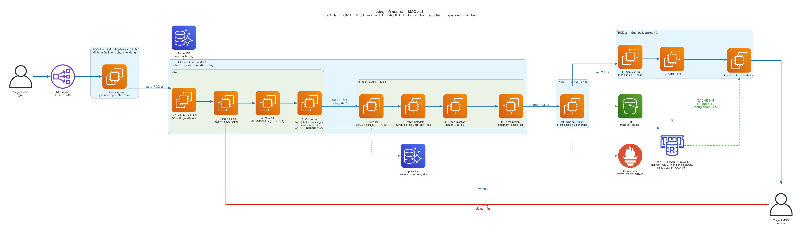

# DA#51 — Bản đồ dự án

Tài liệu này để bạn định vị được mình đang ở đâu trong repo và chạy được thứ mình cần,
không đi sâu vào lý do từng quyết định. Phần lý do nằm trong `README.md` (573 dòng) và
trong chính các file mã — mọi module đều mở đầu bằng một khối giải thích **vì sao** nó
được viết như vậy. Khi tài liệu này và mã mâu thuẫn nhau thì tin vào mã.

Tài liệu chi tiết cho từng mảng:

| | |
|---|---|
| [`GUARDRAILS.md`](GUARDRAILS.md) | Mô hình mối đe doạ, ba lớp phòng thủ, bộ test 298 mẫu chia hai nửa, và số đo trên nửa giữ lại |
| [`diagrams/request_flow.png`](diagrams/request_flow.png) | Sơ đồ luồng một request, cả nhánh cache HIT lẫn MISS |

---

## 1. Đề tài và tiêu chí nghiệm thu

Một nền serving LLM nội bộ dùng chung cho ≥7 agent copilot MOC, có guardrail và đo lường
được. Ngân sách AWS **200 USD**, 6 tuần.

| Tiêu chí | Trạng thái |
|---|---|
| p95 < 3s ở 50 req/s | đo được p95; **chưa chạm 50 req/s** (đỉnh 1,98) |
| Uptime ≥ 99,5%, pilot 2 tuần | **chưa có gì** — cần probe ngoài cụm |
| Chi phí/1k token giảm ≥30% so với API ngoài | **chưa có metric nào** |
| Chặn ≥95% bộ test prompt injection / PII leak | **81,2% trên nửa giữ lại** của bộ 298 mẫu — chưa đạt |
| Dashboard latency/chi phí/token **theo agent** | chưa có nhãn `agent` — cần gateway |

Đọc bảng này trước khi bắt tay vào bất cứ việc gì: bốn trên năm dòng còn trống.

---

## 2. Bản đồ repo

```
terraform/core/        VPC, S3 bucket, ECR, cảnh báo ngân sách.  Tạo 1 lần, MIỄN PHÍ
terraform/cluster/     EKS + node group.                         TÍNH TIỀN THEO GIỜ
charts/vllm/           Helm chart chạy vLLM, tham số hoá 2 model
k8s/monitoring/        kube-prometheus-stack + GPU Operator (chỉ DCGM)
k8s/ingress/           ingress-nginx trên NodePort, mở URL ra ngoài
observability/         PrometheusRule + dashboard Grafana (dạng code)
bench/                 bộ tạo tải, dataset, script vận hành
rag/                   truy hồi: BM25 tiếng Việt, RRF, policy metadata, bộ đo
guardrails/            PII, prompt injection, kiểm tra căn cứ, pipeline ghép lại
prompt/                chuẩn hoá câu hỏi + dựng prompt cho prefix cache
data/                  corpus và warehouse tổng hợp  (Minh)
tests/                 kiểm tra hành vi của guardrails
```

**Hai tầng Terraform là chi tiết quan trọng nhất về chi phí.** `core` chứa những thứ miễn
phí và phải sống suốt 6 tuần (bucket đựng trọng số model, dataset, kết quả đo). `cluster`
chứa mọi thứ tính tiền theo giờ và **bị xoá mỗi tối**. Đừng bao giờ chạy `make core-down`
trừ tuần 6 — nó xoá luôn bucket.

---

## 3. Một request đi qua những gì



Dựng lại bằng `make diagrams`. Nguồn: `docs/diagrams/request_flow.py` (`diagrams` +
Graphviz). Sơ đồ này bổ sung cho sơ đồ hạ tầng: sơ đồ kia trả lời *cái gì chạy ở đâu*,
sơ đồ này trả lời *theo thứ tự nào* — và thứ tự mới là chỗ tính đúng nằm.

### 3.0 Đọc sơ đồ

**Bốn màu cạnh, mỗi màu một ý nghĩa:**

| | |
|---|---|
| **Xanh đậm, liền** | Đường tới hạn khi **CACHE MISS** — request phải đi hết |
| **Xanh lá, đứt** | Đường tắt khi **CACHE HIT** — nhảy từ bước 5 thẳng tới 13 |
| **Đỏ, đậm** | Từ chối. Request chết tại đó, không gì phía sau chạy |
| **Xám, chấm** | Ngoài đường tới hạn: tra cứu phụ, ghi lưu trữ, telemetry |

**Người gọi được vẽ hai lần** — `(gửi)` bên trái, `(nhận)` bên phải. Một node duy nhất sẽ
kéo mọi cạnh đường về vắt ngang đồ thị và biến luồng trái-phải thành mớ rối. Đây là quy
ước vẽ, không phải hai hệ thống khác nhau.

### 3.0a Ba pod, và pod nào sở hữu cái gì

| Pod | Sở hữu | Nguyên tắc |
|---|---|---|
| **POD 1** LiteLLM Gateway (CPU) | API key, quota, định tuyến, nhãn agent, retry | **Không chạm nội dung** |
| **POD 2** Guardrail (CPU) | Bước 2–9 và 11–13, cộng truy hồi | **Mọi bước đọc nội dung đều ở đây** |
| **POD 3** vLLM (GPU) | Bước 10 | Chỉ sinh văn bản |

Ranh giới là *"ai được đọc nội dung câu hỏi"*. Gateway định tuyến theo metadata — khoá
API, quota, model đích. Nó không cần biết người dùng hỏi gì. Mọi bước cần đọc nội dung
đều nằm trong POD 2, nên chỉ có một nơi để audit và một codebase để sửa khi thêm luật.

**Redis nối vào POD 2, không phải gateway** — và đây là chỗ sơ đồ hạ tầng cần sửa.

Cache key chỉ đúng khi dựng từ câu hỏi **đã chuẩn hoá** và **đã che PII**. Cả hai việc đó
nằm trong POD 2. Nếu gateway tra cache trước khi gọi guardrail thì:

```
1. key dựng trên văn bản thô   → "Cho tôi biết: X" và "X" thành hai entry
2. PII chưa che nằm trong key  → dữ liệu định danh vào Redis và vào log
3. prompt độc hại được tra cứu → có thể trả về trước khi bị chặn
```

Chuyển Redis sang POD 2 là sửa cả ba, và luồng vẫn thẳng đúng như mũi tên trong sơ đồ hạ
tầng: gateway → guardrail → vLLM.

**Phương án khác**, ghi lại cho đủ: giữ Redis ở gateway và dùng cache có sẵn của LiteLLM —
nhưng khi đó chuẩn hoá và che PII buộc phải chuyển vào gateway luôn. Nó chạy được, và nó
chia logic an toàn ra hai service. Hai nơi cho cùng một kiểm soát bảo mật là tình huống mà
bản được sửa không bao giờ là bản đang chạy.

**Truy hồi nằm trong POD 2** — sơ đồ hạ tầng hiện chưa có thành phần này. Lý do đặt ở đây
là bước 8: quét injection trên tài liệu phải đọc chính các chunk vừa truy hồi. Tách truy
hồi khỏi bộ quét đọc đầu ra của nó nghĩa là chuyển 5 chunk × ~900 ký tự qua mạng hai lần
mỗi request, để chia đôi hai bước luôn chạy cùng nhau.

### 3.0b Mười ba bước

**POD 1 — gateway**

**1 · Auth + quota.** Đối chiếu khoá API với Aurora, trừ quota, và **gắn nhãn `agent`** —
nhãn này là thứ làm dashboard tách được theo agent như đề bài yêu cầu. Đây là nơi duy nhất
biết ai đang gọi.

**POD 2 — guardrail, chiều vào**

**2 · Chuẩn hoá câu hỏi.** NFC, cắt cụm dẫn nhập (`"Cho tôi biết: "`), tách dấu hiệu phạm
vi. **Đặt trước bước 5 vì nó quyết định cache key.** Đo được: chuẩn hoá trước đưa tỉ lệ
cặp diễn đạt lấy ra cùng tập chunk từ 18,5% lên 100%.

**3 · Chặn injection, nguồn = người dùng.** Gấp né tránh (zero-width, fullwidth, giãn chữ,
**không dấu**) rồi so 10 luật HIGH + 6 luật MEDIUM ở cả hai dạng có dấu và không dấu.
**BLOCK thì dừng hẳn** — không truy hồi, không cache, không GPU.

**4 · Che PII.** `0912345678` → `[PHONE_1]`, giữ ánh xạ cho bước 13. **Đặt trước truy hồi,
không phải trước model**: che muộn thì giá trị gốc vẫn nằm trong truy vấn tìm kiếm, trong
log và trong trace — ba bản sao ngoài model mà không ai coi là vấn đề của LLM.

**5 · Cache key và điểm rẽ nhánh.** `hash(câu đã chuẩn hoá + agent + access_level)`. Nếu
bước 4 tìm thấy PII thì **bỏ qua cache hoàn toàn** (lý do ở §3.0c).

**POD 2 — chỉ khi CACHE MISS**

**6 · Truy hồi.** BM25 trên unigram+bigram âm tiết, cộng dense trên vector dựng sẵn, gộp
bằng RRF k=60 → 15 ứng viên.

**7 · Policy metadata.** Quyền: `access_level` không đủ → **bỏ hẳn, chỉ đếm**. Hiệu lực:
`status ≠ active` → **giữ lại và gắn lời nhắc** vào system prompt.

**8 · Chặn injection, nguồn = tài liệu.** Cùng bộ luật, mức độ nâng lên. **Bỏ chunk nhiễm,
giữ phần còn lại** — một tài liệu nhiễm không được phép giết mọi câu hỏi chạm tới nó.
Đặt sau bước 7 vì quét 50 ứng viên để bảo vệ 5 cái sống sót là gấp 10 lần việc cần làm.

**9 · Dựng prompt.** Prefix ổn định lên trước, datamarking cho nội dung chunk, `cache_salt`
theo `agent|access_level`. Chi tiết ở §3.1 và §3.2.

**POD 3 — GPU**

**10 · Sinh câu trả lời.** Prefix cache KV nằm **bên trong** engine này. Nó **khác hẳn**
Redis: Redis lưu câu trả lời hoàn chỉnh và một lần trúng bỏ qua cả truy hồi lẫn GPU;
prefix cache lưu khối KV và chỉ giúp request đã tới được đây.

**POD 2 — chiều về**

**11 · Kiểm căn cứ.** Trích dẫn `[MÃ]` không có trong ngữ cảnh → **chặn, chính xác tuyệt
đối**. Khẳng định không kèm nguồn → chặn. Lời từ chối thuần → cho qua.

**12 · Quét PII đầu ra.** Số định danh trong câu trả lời → chặn, bất kể nó từ đâu ra.

**13 · Khôi phục placeholder.** `[PHONE_1]` → `0912345678`, **chỉ những giá trị chính
người này đã nhập**. Đường CACHE HIT nhảy thẳng vào đây — vì khôi phục là việc riêng của
từng request, không nằm trong thứ được cache.

### 3.0c Năm quy tắc của semantic cache

**1. Chuẩn hoá trước khi dựng key** (bước 2 trước bước 5).

**2. Key phải chứa `access_level`.** Câu trả lời trong cache được tính từ tài liệu mà
người gọi đầu tiên được phép đọc. Phục vụ nó cho người ít quyền hơn là rò chính những tài
liệu đó qua bản tóm tắt. Cùng lập luận với `cache_salt` của vLLM, chỉ ở tầng trên.

**3. Che PII trước khi chạm cache** (bước 4 trước bước 5).

**4. Request có PII thì KHÔNG cache.** Hệ quả ngược của quy tắc 3, và là chỗ dễ sai nhất:

```
A hỏi  "tra cứu chuyến của 0912345678"  →  "tra cứu chuyến của [PHONE_1]"
B hỏi  "tra cứu chuyến của 0987654321"  →  "tra cứu chuyến của [PHONE_1]"   ← TRÙNG KEY
```

B nhận câu trả lời tính từ dữ liệu của A, rồi bước 13 thay `[PHONE_1]` bằng số của B — rò
dữ liệu **đến tay B khoác chính thông tin của B**, và không chỗ nào trông sai. Đưa giá trị
đã che vào key thì hết trùng, nhưng lại nhét dữ liệu định danh trở vào key, đúng thứ việc
che sinh ra để tránh.

**5. Cache hit không được đi vòng qua bước 11–12.** Giải bằng **bất biến** chứ không bằng
kiểm lại: cạnh ghi vào Redis xuất phát từ **bước 12**, không phải bước 10 — nên chỉ câu
trả lời đã qua kiểm mới vào được cache, và một lần trúng an toàn nhờ thứ đã được cho vào.
Kiểm lại mỗi lần trúng thì vứt đi phần lớn độ trễ mà cache được mua về.

**Chưa xử lý:** câu trả lời trong cache tính từ corpus tại thời điểm T. Khi một tài liệu
chuyển `deprecated`, mọi entry dựa trên nó thành sai mà không ai biết. Cần TTL hoặc xoá
theo `document_id`.

### 3.0d Ở đâu thì dừng, và dừng kiểu gì

| Bước | Phản ứng | Vì sao |
|---|---|---|
| 3 · injection người dùng | từ chối cả request | không có gì đáng cứu |
| 7 · quyền | bỏ im lặng, chỉ đếm | nêu tên đã là rò rỉ về việc cái gì tồn tại |
| 7 · hiệu lực | giữ lại **và nói ra** | người dùng cần biết định nghĩa đã đổi |
| 8 · injection tài liệu | bỏ chunk, giữ phần còn lại | một tài liệu nhiễm không được giết mọi câu hỏi chạm tới nó |
| 11 · trích dẫn bịa | chặn câu trả lời | |
| 12 · PII đầu ra | chặn câu trả lời | |

### 3.1 Prompt được dựng như thế nào, và cache nằm ở đâu

vLLM băm KV cache theo **chuỗi block**: mỗi block gồm hash của block cha cộng token id
trong block, và **chỉ block đầy mới được cache** (mặc định 16 token). Hệ quả duy nhất cần
nhớ: **hai request dùng chung phần tính toán đúng bằng đoạn token trùng nhau tính từ vị
trí 0.** Một token khác ở vị trí 3 là vứt toàn bộ phía sau.

Nên prompt được xếp theo thứ tự **ít đổi nhất lên trước**:

```
┌─ system ──────────────────────────────────────────────────────┐
│ Luật cơ bản                        giống hệt mọi request      │  ← cache
│ Luật spotlight + ký tự đánh dấu    cố định theo phiên         │  ← cache
│ Lời nhắc tài liệu hết hiệu lực     chỉ khi ⑤ giữ lại gì đó    │  ← cache
│ ## Dữ liệu tham khảo                                           │
│ [METRIC-REV-001]                   ← MÃ NẰM NGOÀI vùng đánh dấu│
│ Gross^Booking^Value^và^doanh^thu…  ← nội dung đã datamark      │
│ [METRIC-TRIP-001]                  sắp theo document_id,       │
│ Định^nghĩa^chuyến^hoàn^thành…      KHÔNG theo điểm số          │
└────────────────────────────────────────────────────────────────┘
┌─ user ─────────────────────────────────────────────────────────┐
│ Câu hỏi đã chuẩn hoá               luôn khác → đặt cuối cùng   │
└────────────────────────────────────────────────────────────────┘
cache_salt = sha256("<agent>|<access_level>")[:16]
```

**Vì sao sắp chunk theo `document_id` chứ không theo điểm.** Hai cách diễn đạt của cùng
một câu hỏi thường lấy ra cùng tập chunk nhưng khác thứ tự. Sắp theo điểm thì prefix vỡ
ngay ở chunk đầu; sắp theo id thì hai prompt giống nhau đến tận câu hỏi. Đo được: **+0,9%**
— nhỏ, vì chỉ 18,5% cặp lấy ra cùng tập. Bước ③ mới là đòn bẩy thật, kéo con số đó lên
100% trên bộ eval.

**Vì sao mã tài liệu nằm ngoài vùng đánh dấu.** Model phải nhắc lại `[METRIC-REV-001]`
nguyên văn để bước ⑧ đối chiếu được. Datamark nó thành `[METRIC-REV-001]` có dấu chen vào
là không trích dẫn nào khớp được nữa.

**`cache_salt` là kiểm soát bảo mật, không phải nút tinh chỉnh.** vLLM trộn salt vào hash
của block đầu tiên, nên chỉ request cùng salt mới dùng lại KV của nhau. Hai người khác
quyền truy cập **không bao giờ** chia sẻ KV suy ra từ tài liệu chỉ một người được đọc.
Salt sinh từ `agent|access_level`, không từ id người dùng — salt theo người dùng an toàn
tương đương nhưng giết sạch cache.

### 3.2 Datamarking: nó là gì và tốn bao nhiêu

Mọi khoảng trắng trong dữ liệu truy hồi bị thay bằng một ký tự đánh dấu, và system prompt
nói cho model biết điều đó có nghĩa gì. Lấy từ Hines et al. (arXiv:2403.14720), biến thể
**datamarking** — bài báo nói rõ **không nên** chỉ dùng delimiting.

```
gốc      Gross Booking Value và doanh thu thuần
đánh dấu Gross^Booking^Value^và^doanh^thu^thuần
```

Ý tưởng: tín hiệu xuất xứ xuất hiện **liên tục** trong văn bản, không chỉ ở hai đầu, nên
model khó nhầm dữ liệu thành chỉ dẫn hơn. Bài báo đo được ASR giảm từ >50% xuống <2%.

Chi phí, đo bằng chính tokenizer của engine trên corpus này:

| marker | token | tỉ lệ | va chạm |
|---|---|---|---|
| U+E000 (bài báo khuyến nghị) | 522.425 | **1,75x** | 0 |
| `^` (đang dùng) | 377.361 | **1,26x** | 0 |
| `|` | 381.528 | 1,28x | 2.880 |

Số **ký tự** gần như không đổi, nên ai đo ký tự sẽ kết luận datamarking miễn phí. Chi phí
nằm hoàn toàn ở tokenisation: U+E000 ngoài từ điển BPE nên rơi xuống byte-level. Với ngữ
cảnh 5 chunk: **1.964 → 3.273 token**. Trên card mà nút thắt là băng thông bộ nhớ, đó là
thời gian prefill và KV cache mà batch không dùng được.

`^` được chọn tự động vì nó rẻ hơn và **không xuất hiện lần nào** trong corpus này —
kiểm tại thời điểm dựng index, không phải giả định. Corpus tương lai có mã nguồn hay LaTeX
thì nó tự rơi về U+E000.

### 3.3 Ở đâu thì dừng, và dừng kiểu gì

| Chặng | Phản ứng | Vì sao |
|---|---|---|
| ① injection người dùng | từ chối cả request | không có gì đáng cứu |
| ⑤ quyền | bỏ im lặng, chỉ đếm | nêu tên đã là rò rỉ |
| ⑤ hiệu lực | giữ lại **và nói ra** | người dùng cần biết định nghĩa đã đổi |
| ⑥ injection tài liệu | bỏ chunk, giữ phần còn lại | một tài liệu nhiễm không được giết mọi câu hỏi chạm tới nó |
| ⑥b known-answer | từ chối cả request | kiểm trên ngữ cảnh gộp, không biết chunk nào |
| ⑧ trích dẫn bịa | chặn câu trả lời | |
| ⑨ PII đầu ra | chặn câu trả lời | |

## 4. Vòng đời một phiên làm việc

```bash
make lab-up            # dựng cụm, GPU vẫn ở 0        ~15 phút
make kubeconfig
make monitoring-up     # Prometheus, Grafana, DCGM
make gpu n=1           # BẬT GPU — từ giây này tốn 0,80 USD/giờ
make vllm-up           # MODE=shared | solo-a | solo-b
make smoke CLASS=a     # 7 kiểm tra, phải pass hết
make audit-metrics     # tên metric có khớp engine thật không

# ... làm việc ...

make lab-down          # tự xuất số liệu lên S3 rồi mới xoá   ~15 phút
```

**Nhìn `make gpu n=1` như nhìn công tắc tiền.** Chi phí khi mọi thứ chạy:

```
EKS control plane   0,10 USD/giờ
m7i.large (tooling) 0,10
g6.xlarge (GPU)     0,80   ← 80% hoá đơn
                    ────
                    1,01 USD/giờ
```

Sau `lab-down` là **0 USD/giờ**. Một ngày làm việc ~7 giờ tốn khoảng 7 USD.

Muốn xem dashboard: `make ingress-up` rồi `make ingress-url`. Mật khẩu: `make creds`.
Ingress mở cổng 30080 chỉ cho IP của người chạy lệnh; thêm người khác bằng
`make ingress-up EXTRA_CIDRS=<ip>/32`.

---

## 5. Phần RAG và guardrail chạy được ngay, không cần cụm

Toàn bộ chạy trên CPU, không tải model, không cần AWS:

```bash
make guardrails-test        # 30 kiểm tra hành vi
make rag-eval               # đo truy hồi trên 144 truy vấn vàng
make rag-eval-nopolicy      # cho thấy lớp metadata đáng giá bao nhiêu
make attacks-score FOLD=B   # chấm guardrail trên nửa bộ test GIỮ LẠI
make rag-data               # kéo corpus từ s3://.../datasets/v1/

Cần torch (một lần: `make dense-env`):

```bash
make dense-build         # mã hoá corpus, ~42s trên MPS
make dense-ablation      # lexical vs dense vs gộp, tách theo loại truy vấn
```
```

Nhánh **dense chưa có ai hiện thực**. `rag/retrieve.py` đã định nghĩa interface
`DenseRanker`; chỗ đúng để chạy nó là slot time-slicing thứ hai của con L4, cạnh vLLM.

---

## 6. Số liệu đã đo được

Đây là tài sản thật của dự án tính đến lúc này. Chuỗi thời gian đầy đủ nằm ở
`s3://<artifacts>/runs/20260921T102259Z-w1-ramp/`.

### Phần cứng — nghẽn ở đâu

```
luồng đồng thời    4      8     16     32
token/s           66    131    258    468      ← còn tăng gần tuyến tính
hàng đợi           0      0      0      0      ← chưa bao giờ hình thành
TTFT p95        0,24s  0,24s  0,24s  0,43s
ITL p99        0,075s 0,075s 0,075s 0,085s
```

```
GPU_UTIL (thô)        100%   ← vô dụng, bão hoà ở tải tầm thường
băng thông bộ nhớ      94%   ← ĐÂY là nghẽn
tensor core          6-35%   ← rảnh phần lớn thời gian
```

**Nghẽn là băng thông bộ nhớ, không phải tính toán.** Mỗi bước decode phải đọc toàn bộ
15,23 GB trọng số; L4 có 300 GB/s, nên sàn vật lý là **51 ms/token**. SLO 40ms **không
đạt được với FP16** ở bất kỳ số GPU nào. AWQ 4-bit đưa sàn xuống ~24ms.

Thêm một trần nữa: L4 bị **chặn công suất ở 72W**, xung tụt 2040 → 1400 MHz khi có tải.
Không phải quá nhiệt (70°C, ngưỡng ~85°C). Khi so với L40S (350W) nhớ ghi lại biến này.

### RAG — lớp metadata

```
              nDCG@10   R@10    dính bẫy
có policy      0,508    0,586     0,000
không policy   0,501    0,584     0,542
```

Corpus có 4 tài liệu `deprecated`/`draft` nói **đúng chủ đề** với đáp án đúng. Tắt policy
thì 54% truy vấn nạp định nghĩa hết hiệu lực vào ngữ cảnh, trong khi nDCG chỉ nhích 0,007.
Không mô hình nhúng nào phân biệt được — khác biệt nằm ở metadata, không nằm ở ngữ nghĩa.

### RAG — chuẩn hoá truy vấn

```
             R@10    nDCG    MRR   | trùng tập chunk  prefix chung
gốc          0,586   0,508   0,624 |      18,5%          45,1%
chuẩn hoá    0,616   0,570   0,734 |     100,0%         100,0%
```

Con số 100% là **cận trên**, không phải ước lượng production: bộ eval sinh biến thể bằng
ba mẫu dẫn nhập cố định. Phần tổng quát hoá được là nDCG +0,062 và MRR +0,110.

Chỗ yếu nhất hiện tại, cần nhánh dense để cứu:

```
loại truy vấn   R@1     R@10
retrieval      0,693   0,932   ← BM25 làm tốt
hybrid         0,177   0,425
reasoning      0,000   0,471   ← BM25 mù hoàn toàn
```

---

## 7. Bẫy đã biết — đọc trước khi mất hai giờ

**`kubectl` treo rồi timeout, không báo lỗi quyền.** ISP đổi IP (xảy ra 4 lần trong một
tuần). EKS chặn ở tầng mạng nên triệu chứng giống cụm hỏng. Sửa: `make fix-cidr`.

**Docker Desktop cướp `kubectl` context.** Bật Docker lên là `~/.kube/config` bị ghi đè,
`current-context` nhảy sang `docker-desktop`. Triệu chứng: `namespaces "monitoring" not
found`. Kiểm tra `kubectl config current-context` trước tiên.

**`terraform apply -var gpu_desired=1` không làm gì cả.** Module EKS đặt
`ignore_changes = [scaling_config[0].desired_size]`. Phải dùng `make gpu n=1` (đi qua AWS
CLI). Đây cũng là lý do đổi ngoài Terraform không gây drift.

**`terraform destroy` để lại rác tính tiền.** Volume EBS và load balancer do controller
trong cụm tạo ra, không do Terraform. `make lab-down` xoá chúng trước, theo đúng thứ tự.
Đừng chạy `terraform destroy` tay.

**Tên metric của vLLM đổi giữa các phiên bản.** v0.29 đổi 3 tên và xoá 1. Chạy
`make audit-metrics` sau mỗi lần nâng cấp engine, trước khi tin bất kỳ con số nào.

**EKS console không xem được Pod/Node.** Không phải lỗi RBAC. Console gọi Kubernetes API
từ hạ tầng AWS, mà IP đó không nằm trong `publicAccessCidrs`. Dùng `kubectl`.

**Mạng rớt giữa `terraform destroy`** để lại khoá state trên S3. Gỡ bằng
`terraform -chdir=terraform/cluster force-unlock <ID>` rồi chạy lại.

---

## 8. Ai làm gì, và việc tiếp theo

| Mảng | Trạng thái |
|---|---|
| Hạ tầng, serving, giám sát, bộ đo | xong |
| RAG + guardrail (BM25, PII, injection, grounding, cache) | xong, chạy CPU |
| Dataset tổng hợp (warehouse + corpus truy hồi) | Minh, xong |
| Nhánh dense (BM25 + embedding, RRF) | xong |
| Bộ test tấn công 298 mẫu, chia hai nửa | xong |
| Rerank | **chưa ai làm** |
| Gateway LiteLLM (nhãn agent, đếm lỗi, định tuyến) | **chưa ai làm** |
| Probe uptime ngoài cụm (Lambda) | Minh, chưa làm |
| Panel chi phí/1k token | chưa ai làm |
| Bộ test tấn công ~200 mẫu tiếng Việt | chưa ai làm |

Thứ tự đề nghị: **dense + rerank** trước (nó mở khoá hai nhóm truy vấn đang hỏng), rồi
**gateway** (vì guardrail sẽ cắm vào đó, và nó mang theo nhãn `agent` mà đề bài đòi), rồi
mới tới phần đo chi phí và uptime.

Một câu nên hỏi mentor sớm, vì nó quyết định toàn bộ bài toán sizing: **câu trả lời trung
bình của MOC dài bao nhiêu token?** Với ITL hiện tại, ràng buộc "p95 < 3s" chỉ đủ cho
khoảng 43 token đầu ra. Nếu thực tế là 300 token thì SLO đó không đạt được với bất kỳ số
GPU nào, và biết sớm thì hơn.
