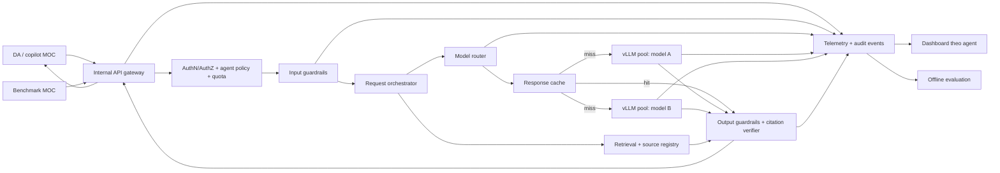

# Kiến trúc LLM Serving & Guardrails cho copilot MOC

> Bản thiết kế mục tiêu · 18/09/2026  
> Phạm vi: nền phục vụ nhiều mô hình cho ít nhất 7 DA/agent MOC, có đo độ trễ, chi phí và an toàn theo từng agent.

## 1. Mục tiêu thiết kế

Nền tảng cung cấp một API nội bộ thống nhất cho các DA của MOC. Mỗi request được xác thực, gắn định danh agent, kiểm tra an toàn, định tuyến đến mô hình phù hợp, rồi kiểm tra câu trả lời trước khi trả về. vLLM là serving engine cho các mô hình triển khai nội bộ. Batching, prefix cache và response cache giúp tận dụng GPU; benchmark theo tải MOC quyết định số replica, cấu hình và chính sách route. Hệ thống ghi telemetry và audit metadata để giải thích p95, chi phí/token và kết quả guardrail theo từng agent.

Các kết quả cần chứng minh:

| Mã | Ngưỡng nghiệm thu | Đơn vị đo chính |
|---|---|---|
| TC1 | p95 < 3 giây tại 50 req/s; uptime ≥ 99,5% trong pilot 2 tuần | End-to-end qua API, 14 ngày probe liên tục |
| TC2 | Chi phí/1.000 token giảm ≥ 30% so với API ngoài | Tổng chi phí phân bổ / token, cùng workload và token mix |
| TC3 | Chặn ≥ 95% bộ test prompt injection/PII leak | Tỷ lệ chặn trên tập unsafe có nhãn |
| TC4 | Ít nhất 5 DA chạy trên nền tảng | Request thành công và telemetry có agent ID |

Mục tiêu tích hợp của nền tảng là **ít nhất 7 agent MOC**; TC4 là mốc nghiệm thu tối thiểu. Thiết kế không gắn cứng số model, loại GPU hay số replica trước khi có workload và benchmark.

## 2. Sơ đồ kiến trúc tổng thể

**Luồng chuẩn:** DA gửi request kèm danh tính dịch vụ → gateway xác thực và gán `request_id`/`agent_id` → input guardrail kiểm tra PII và prompt injection → orchestrator lấy tài liệu có quyền truy cập khi cần → router chọn model và cache → vLLM sinh câu trả lời → output guardrail kiểm tra PII/chính sách/trích dẫn → trả response có metadata nguồn và ghi telemetry. Lỗi ở từng bước phải có mã lỗi riêng để dashboard phân biệt lỗi model, guardrail, retrieval, gateway và upstream.

## 3. Hợp đồng API và định danh

Dùng API thống nhất theo kiểu OpenAI-compatible cho tác vụ chat; gateway là điểm vào duy nhất. Mỗi DA có service identity, quota, danh sách model/route được phép, policy dữ liệu và owner. Client không chọn tùy ý model bị cấm hoặc bỏ qua guardrail. Gateway truyền các trường chuẩn tới toàn pipeline:

| Trường | Mục đích |
|---|---|
| `request_id`, `trace_id` | Liên kết latency, quyết định guardrail và lỗi qua các thành phần |
| `agent_id`, `tenant_id` | Phân quyền, quota, cache isolation, dashboard và phân bổ chi phí |
| `route_id`, `model_id`, `model_version` | Tái lập kết quả và tính cost theo model |
| `prompt_version`, `policy_version` | Truy vết thay đổi chất lượng và an toàn |
| `source_ids` | Liên kết câu trả lời với tài liệu được phép dùng |
| `input_tokens`, `output_tokens`, `cache_state` | Chi phí, capacity và phân tích hiệu năng |

Streaming được hỗ trợ nếu DA cần, nhưng TC1 phải dùng một định nghĩa p95 thống nhất. Mặc định đo thời gian từ lúc gateway nhận request đến khi response hoàn tất; báo thêm time-to-first-token cho streaming. Request lỗi hoặc bị guardrail chặn được báo riêng, không âm thầm loại khỏi mẫu latency.

## 4. Multi-model serving, batching và cache

Mỗi model có vLLM deployment/pool riêng để cấu hình phiên bản, GPU, context length và giới hạn concurrency độc lập. Router chọn pool bằng policy theo agent, loại tác vụ, độ nhạy dữ liệu, chất lượng, độ trễ và chi phí. Route fallback chỉ đến model đã được offline eval cho cùng tác vụ và cùng policy; không chuyển dữ liệu nhạy cảm sang một API ngoài mặc định.

vLLM thực hiện continuous batching ở mỗi pool. Cấu hình `max_num_seqs`, context length, memory utilization và prefix caching được benchmark trên workload MOC trước khi khóa. Batching tăng throughput nhưng có thể kéo dài tail latency, nên chọn operating point bằng p95 tại 50 req/s và error rate, không chỉ output tokens/s.

Cache có hai lớp:

1. **Prefix cache trong vLLM:** tái sử dụng phần prompt chung khi model/tokenizer/prompt prefix tương thích. Đo hit và miss riêng.
2. **Response cache ở gateway/router:** chỉ áp dụng cho request có thể tái sử dụng an toàn. Cache key gồm tenant/agent, quyền tài liệu, model và version, prompt/policy version, retrieval snapshot và tham số sinh. Dữ liệu nhạy cảm hoặc kết quả cá nhân hóa không cache dùng chung. Có TTL, invalidation khi tài liệu/policy đổi và audit cache hit.

Benchmark phải có cold-cache, warm-cache và traffic mix thực; không dùng một tỷ lệ cache hit thuận lợi để thay thế số liệu pilot.

## 5. Guardrails và citation

### 5.1. Input guardrail

Phân loại/che PII theo taxonomy MOC; phát hiện chỉ dẫn làm lộ dữ liệu, vượt quyền và prompt injection trực tiếp hoặc nằm trong tài liệu retrieval. Quyết định có ba mức: cho phép, biến đổi/che dữ liệu, hoặc chặn/chuyển xử lý. Rule/policy và detector version được lưu với request. Nội dung tài liệu truy xuất là dữ liệu không tin cậy, không được nâng thành chỉ dẫn hệ thống.

### 5.2. Output guardrail

Quét PII leak, nội dung trái policy và thông tin nguồn trước khi trả cho DA. Nếu đầu ra bị chặn, trả mã lỗi an toàn hoặc câu trả lời từ chối theo hợp đồng API; không phát tán bản nháp qua streaming trước khi bước kiểm tra cần thiết hoàn tất. Với streaming, cần buffer hoặc kiểm tra theo chunk phù hợp với chính sách dữ liệu.

### 5.3. Trích dẫn có nguồn

Retrieval trả `source_id`, phiên bản, đoạn chứng cứ và thông tin quyền truy cập. Citation verifier kiểm tra citation có tham chiếu nguồn được phép và nội dung liên quan đến phần trả lời. Với câu hỏi cần nguồn, câu trả lời thiếu nguồn hợp lệ phải được từ chối hoặc đánh dấu không đủ chứng cứ theo policy của DA. Kiểm tra citation không đồng nghĩa bảo đảm mọi mệnh đề là đúng; offline eval cần đo thêm groundedness trên mẫu gán nhãn.

### 5.4. Offline evaluation

Bộ test version hóa gồm unsafe cases (prompt injection trực tiếp/gián tiếp, PII leak đầu vào/đầu ra), benign cases để đo false positive, và câu hỏi có/không có nguồn. Báo `blocked_unsafe / all_unsafe`, false-positive rate, lỗi theo loại và thay đổi qua mỗi model/policy release. TC3 đạt khi tỷ lệ chặn trên tập unsafe ≥ 95%; công bố mẫu số và tập test, không dùng vài ví dụ thủ công.

## 6. Logging, audit và observability

Telemetry bắt đầu tại gateway và giữ `request_id` xuyên các thành phần. Log mặc định chỉ chứa metadata cần vận hành: agent, route, model/policy version, quyết định guardrail, source IDs, token usage, cache state, latency từng giai đoạn và lỗi. Prompt/response thô chỉ lưu theo chính sách truy cập/retention đã được phê duyệt, có che PII và tách quyền truy cập. Audit event cho biết ai gọi, policy nào được áp dụng và quyết định gì, không dựa vào raw text để điều tra thông thường.

Dashboard tối thiểu theo agent, model và route:

- Traffic req/s, success/error/block rate, p50/p95/p99 end-to-end, TTFT và latency theo gateway/guardrail/retrieval/queue/inference/output check.
- Input/output tokens, GPU utilization/memory, vLLM queue/running requests, batch behavior và cache hit/miss.
- Chi phí ngày, chi phí/1.000 token, phân bổ fixed cost, chi phí theo agent/model/route; so sánh với API ngoài trên cùng token mix.
- Uptime probe từ bên ngoài gateway, sự cố và thời gian phục hồi trong cửa sổ pilot.
- Guardrail blocks, false positives từ eval, citation coverage và lỗi nguồn.

Metrics label không chứa PII, raw prompt hoặc `request_id` nếu gây cardinality quá cao; trace/log dùng `request_id` để drill down. Dashboard luôn phân biệt số liệu từ benchmark, pilot và offline eval.

## 7. Benchmark, SLO và phương pháp nghiệm thu

Tập tải MOC lấy mẫu từ các DA pilot, khử nhạy cảm nhưng giữ phân bố input/output token, loại tác vụ, tỷ lệ agent/model, retrieval và cache. Chạy load generator từ phía client qua gateway ở open-loop arrival rate 50 req/s, warm-up, lặp nhiều lần, ghi dataset hash, model/policy version, topology, cache state và cấu hình vLLM. Cần báo throughput hoàn tất, lỗi, timeout, p95 và các request bị chặn; nếu guardrail chặn nhiều request, tải inference thực tế được báo riêng để tránh hiểu sai capacity.

TC1 latency đạt khi p95 end-to-end < 3 giây trên workload đã chốt tại 50 req/s. Uptime pilot đạt khi successful probes / total valid probes ≥ 99,5% trong 14 ngày liên tục; 14 ngày có tối đa 100,8 phút downtime tương ứng nếu probe liên tục và không có loại trừ. Cách tính probe, cửa sổ bảo trì và timeout phải được cố định trước pilot.

TC2 dùng tổng chi phí phục vụ của kỳ đo chia tổng token tương ứng × 1.000, gồm GPU/CPU/EKS, gateway, guardrail, retrieval, cache, storage, logs/metrics, mạng và capacity dự phòng. So API ngoài tương đương trên cùng request và token mix; công bố tỷ lệ tiết kiệm cùng giả định phân bổ chi phí chung. TC4 cần danh sách ít nhất 5 DA có request thành công, owner, route và telemetry trong pilot; báo riêng tiến độ mốc ít nhất 7 agent.

## 8. Availability, security và vận hành pilot

Gateway và thành phần điều phối chạy nhiều replica qua ít nhất hai Availability Zone. Các model route quan trọng có capacity dự phòng và health-based routing; khi một pool lỗi, router chỉ fallback tới pool đã được đánh giá tương đương cho tác vụ đó. Mỗi deployment có readiness/liveness probe, timeout, retry có giới hạn, backpressure và quota theo agent để tránh một DA làm nghẽn toàn nền. Model artifact, image và policy được pin version để rollback có thể tái lập.

API chỉ mở qua kết nối nội bộ phù hợp với MOC; dùng TLS, service authentication, quyền tối thiểu cho nguồn dữ liệu và encryption cho artifact/log. Tách quyền quản trị hạ tầng, vận hành model, truy cập audit và chỉnh policy. Pilot 14 ngày cần on-call, runbook cho sự cố gateway/model/guardrail/retrieval, probe liên tục và kiểm thử failover trước khi bắt đầu đo uptime.

## 9. Gói bàn giao

1. Sơ đồ kiến trúc và cấu hình route/model/policy/caching đã version hóa.
2. API contract cho DA, hướng dẫn tích hợp và danh sách ít nhất 5 DA pilot; kế hoạch mở tới ít nhất 7 agent.
3. Bộ benchmark MOC cùng raw results, metadata và báo cáo TC1.
4. Dashboard latency, uptime, token và chi phí theo agent; báo cáo TC2 có đối chứng API ngoài.
5. Bộ test guardrail/citation offline, báo cáo TC3 và danh sách lỗi còn lọt.
6. Nhật ký pilot 14 ngày, báo cáo TC4, runbook, rollback và quyết định vận hành.

Kiến trúc triển khai AWS chi tiết nằm tại [docs/aws-architecture.md](docs/aws-architecture.md). Kế hoạch thực hiện nằm tại [kế hoạch 6 tuần](ke-hoach-trien-khai-vllm-aws-6-tuan.md).
