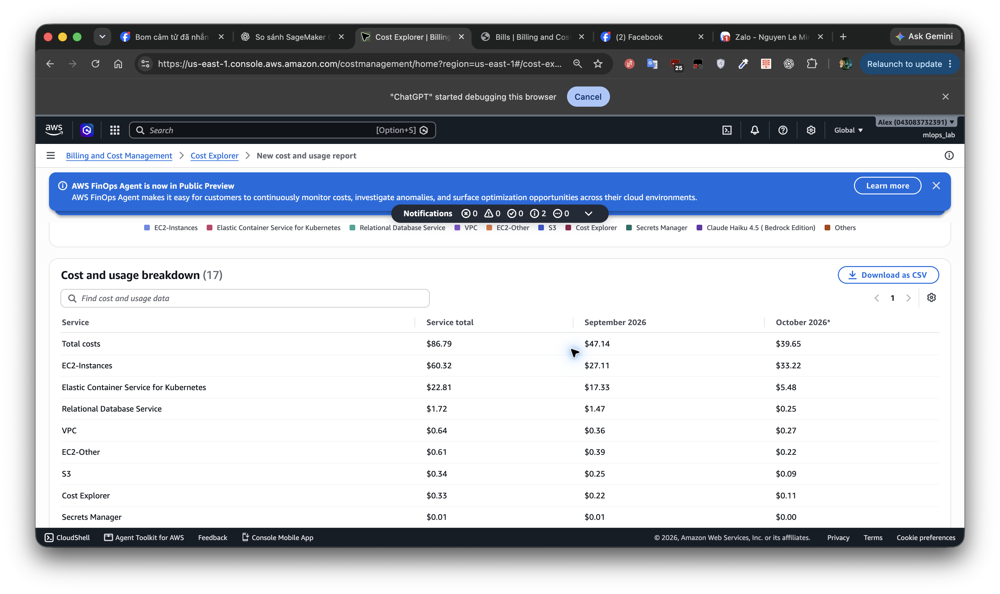

# Báo cáo đánh giá chi phí vận hành AWS liên tục

| Thông tin báo cáo | Giá trị |
| --- | --- |
| Ngày chốt dữ liệu | 07/10/2026 (giờ Việt Nam) |
| Tài khoản / profile AWS | `043083732391` / `vinai` |
| Khu vực triển khai | `us-east-1` |
| Đơn vị tiền tệ | USD, trước thuế và trước credit |
| Kịch bản | Cấu hình hiện tại hoạt động 24 giờ/ngày; không chạy k6 job và WebUI |

## Tóm tắt điều hành

Chi phí duy trì cấu hình hiện tại theo kịch bản vận hành liên tục ước tính **107,21 USD/ngày**, tương đương **750,46 USD/tuần** hoặc **3.216,25 USD/30 ngày**. Cấu hình gồm bốn máy GPU A10G, hai máy CPU, một EKS cluster và một Aurora PostgreSQL instance. Ước tính dựa trên số lượng tài nguyên ghi nhận ngày 07/10/2026 cùng đơn giá đối soát từ AWS Billing và AWS Price List.

| Kỳ vận hành | Số giờ | Chi phí ước tính (USD) |
| --- | ---: | ---: |
| Ngày | 24 | **107,21** |
| Tuần | 168 | **750,46** |
| Tháng quy ước 30 ngày | 720 | **3.216,25** |
| Tháng 10/2026 đủ 31 ngày | 744 | **3.322,75** |

Đây là dự toán cho kịch bản 24/7, không phải chi phí thực tế của một kỳ thanh toán đã hoàn tất. Các khoản phụ thuộc mức sử dụng như Aurora I/O, CPU credit, log và lưu lượng mạng được trình bày riêng tại mục 4. Dự toán không áp dụng Savings Plans, Reserved Instances, promotional credit hoặc free tier. Các tổng được tính từ số liệu chưa làm tròn.

## 1. Cơ sở dữ liệu AWS Billing

Trong giai đoạn **01/09–06/10/2026 UTC**, Cost Explorer ghi nhận **86,79 USD** chi phí `Usage` trước credit cho toàn tài khoản: EC2 Compute 60,32 USD; EKS 22,81 USD; RDS 1,72 USD; VPC 0,64 USD; EBS/EC2-Other 0,61 USD; S3 0,34 USD; Cost Explorer API 0,33 USD. Bằng chứng gồm [ảnh Cost Explorer, các service chính](aws-actual-cost-assets-2026-10-07/aws-ce-services-main.png), [ảnh phần còn lại của bảng](aws-actual-cost-assets-2026-10-07/aws-ce-services-bottom.png), [JSON theo ngày và service](aws-actual-cost-assets-2026-10-07/ce-daily-service-usage.json) và [JSON theo usage type tại `us-east-1`](aws-actual-cost-assets-2026-10-07/ce-daily-use1-usage-type.json).



EC2/EKS có giờ sử dụng đáng kể vào các ngày 17, 21, 23, 25, 28, 30/09 và 01, 02/10. Vì vậy, tổng chi phí lịch sử không đại diện cho 36 ngày vận hành liên tục. Ngày 02/10 phát sinh 36,21 USD nhưng chưa phản ánh đủ 24 giờ của cấu hình bốn GPU. Cost Explorer kết thúc tại ngày 06/10 do độ trễ cập nhật; inventory được kiểm tra ngày 07/10. Tổng 86,79 USD còn bao gồm tài nguyên ngoài cụm `us-east-1`, trong đó có usage tại `ap-southeast-2`. Do tag `project` chưa khả dụng để phân bổ trong Cost Explorer, số liệu Billing được dùng để xác nhận đơn giá, không dùng làm tổng chi phí riêng của hệ thống DA51.

| Usage type tại `us-east-1` | UsageQuantity | UnblendedCost (USD) | Đơn giá từ Billing |
| --- | ---: | ---: | ---: |
| `BoxUsage:g5.xlarge` | 30,75528 máy-giờ | 30,93981 | 1,006 USD/giờ |
| `BoxUsage:g6.xlarge` (L4 ở cấu hình cũ) | 28,20056 máy-giờ | 22,69581 | 0,8048 USD/giờ |
| `BoxUsage:m7i.large` | 65,64389 máy-giờ | 6,61690 | 0,1008 USD/giờ |
| `USE1-AmazonEKS-Hours:perCluster` | 38,01316 giờ | 3,80132 | 0,10 USD/giờ |
| `USE1-AmazonEKS-Hours:extendedSupport` | 38,01316 giờ | 19,00658 | Phụ phí 0,50 USD/giờ của EKS 1.31 |
| `USE1-PublicIPv4:InUseAddress` | 127,24972 IP-giờ | 0,63625 | 0,005 USD/IP-giờ |
| `EBS:VolumeUsage.gp3` | 6,92530 GB-tháng quy đổi | 0,55402 | 0,08 USD/GB-tháng |

Hai dòng EKS lịch sử phản ánh cùng một khoảng thời gian vận hành. Cụm hiện chạy EKS **1.35**, thuộc standard support đến **27/03/2027**; dự toán áp dụng mức **0,10 USD/giờ**. Thiết lập `upgradePolicy.supportType=EXTENDED` quy định cách xử lý khi phiên bản hết standard support, chưa làm phát sinh phụ phí extended support ở thời điểm chốt báo cáo. Tham khảo [vòng đời phiên bản EKS](https://docs.aws.amazon.com/eks/latest/userguide/kubernetes-versions.html) và [bảng giá EKS](https://aws.amazon.com/eks/pricing/).

## 2. Phạm vi tài nguyên và khoản loại trừ

Inventory được kiểm tra ngày 07/10 qua AWS `describe-instances`, `describe-nodegroup`, `describe-cluster`, `describe-db-instances` và `describe-volumes` bằng profile `vinai`. Cấu hình gồm **4 × `g5.xlarge` A10G; 2 × `m7i.large`; 1 EKS 1.35; 1 Aurora PostgreSQL `db.t3.medium`; 6 public IPv4**. EBS có 4 × 40 GiB root volume GPU, 2 × 30 GiB root volume CPU, 20 GiB Prometheus và 4 GiB `webui-data`. Hai bucket artifacts/state có khoảng **24,56 GiB** object; dự toán làm tròn thành 25 GiB S3.

Inventory hiện không có NAT Gateway, ALB hoặc ElastiCache replication group. Các thành phần này trong [dự toán production trước đây](production-cost-estimation-tco-2026-10-05.md) không thuộc cấu hình đang đánh giá. GPU và CPU node group hiện nằm trong một subnet; chi phí ở đây chưa bao gồm phương án dự phòng qua hai Availability Zone.

- **k6 job:** [Manifest k6](../k8s/bench/k6-job.yaml) chạy trên node `tooling` dùng chung, không có EC2 hoặc EBS riêng. Dự toán loại chi phí thực thi, traffic, log và image của k6. Node CPU vẫn được tính vì còn phục vụ LiteLLM, guardrail, Prometheus, Tempo và TEI.
- **WebUI:** Loại workload, chat history, traffic, log và PVC `webui-data` 4 GiB. Phần EBS loại trực tiếp tương đương **0,32 USD/30 ngày** so với 244 GiB volume hiện có. WebUI dùng CPU node chung nên Cost Explorer không cung cấp cơ sở tách một khoản USD theo pod; dự toán vẫn giữ hai CPU nodes.
- **Khoản ngoài cấu hình:** Không tính Cost Explorer API dùng để phân tích, Bedrock thử nghiệm, tài nguyên ở region khác hoặc phụ phí EKS 1.31 cũ.

## 3. Dự toán chi phí theo service

Chi phí tài nguyên theo giờ được nhân với 24 giờ/ngày, 168 giờ/tuần và 720 giờ/30 ngày. Chi phí lưu trữ và secret được phân bổ theo 1/30 ngày hoặc 7/30 tuần từ mức tháng. Aurora dùng chế độ **Standard**: [dữ liệu AWS Price List](aws-actual-cost-assets-2026-10-07/pricing-db-t3-medium.json) ghi nhận `InstanceUsage:db.t3.medium` ở mức **0,082 USD/giờ**; mức `InstanceUsageIOOptimized` 0,107 USD/giờ không áp dụng cho bảng này. EBS tính **240 GiB** sau khi loại 4 GiB WebUI.

| Service / tài nguyên | Số lượng và đơn giá | USD/ngày | USD/tuần | USD/30 ngày | Nguồn đơn giá |
| --- | --- | ---: | ---: | ---: | --- |
| EC2 GPU A10G | 4 × `g5.xlarge` × 1,006 USD/giờ | **96,58** | **676,03** | **2.897,28** | AWS Billing |
| EC2 CPU | 2 × `m7i.large` × 0,1008 USD/giờ | 4,84 | 33,87 | 145,15 | AWS Billing |
| EKS control plane | 1 × 0,10 USD/giờ | 2,40 | 16,80 | 72,00 | AWS Billing; EKS 1.35 standard |
| Aurora instance | 1 × `db.t3.medium` × 0,082 USD/giờ | 1,97 | 13,78 | 59,04 | AWS Price List |
| VPC public IPv4 | 6 × 0,005 USD/IP-giờ | 0,72 | 5,04 | 21,60 | AWS Billing; [bảng giá VPC](https://aws.amazon.com/vpc/pricing/) |
| EBS gp3 | 240 GiB × 0,08 USD/GB-tháng | 0,64 | 4,48 | 19,20 | AWS Billing; [bảng giá EBS](https://aws.amazon.com/ebs/pricing/) |
| S3 Standard | 25 GiB × 0,023 USD/GB-tháng | 0,02 | 0,13 | 0,58 | Inventory; [bảng giá S3](https://aws.amazon.com/s3/pricing/) |
| Aurora storage | Giả định 10 GiB × 0,10 USD/GB-tháng | 0,03 | 0,23 | 1,00 | Giả định dung lượng |
| Secrets Manager | Giả định 1 secret × 0,40 USD/tháng | 0,01 | 0,09 | 0,40 | Một secret RDS trong inventory |
| **Tổng chi phí duy trì cấu hình** | 4,4376 USD/giờ + 21,175 USD/30 ngày | **107,21** | **750,46** | **3.216,25** | Tổng từ số chưa làm tròn |

Trong tổng **3.216,25 USD/30 ngày**, phần xác định từ số node, đơn giá theo giờ và 240 GiB EBS là **3.214,27 USD**; khoảng **1,98 USD** còn lại là S3, Aurora storage và secret theo dung lượng hoặc số lượng nêu trong bảng. ECR hiện có tám image digest guardrail với tổng kích thước image báo bởi ECR khoảng 0,55 GB; repository `bench-runner` trống và chi phí ECR trong bill gần bằng 0. Chi phí ECR storage thực tế cần đối soát theo dung lượng layer và free tier khi vận hành liên tục. EBS và S3 được tính theo dung lượng và thời gian tồn tại thực tế của tài nguyên.

## 4. Biến phí cần theo dõi khi vận hành

| Khoản phí | Căn cứ hiện có | Yếu tố quyết định chi phí 24/7 |
| --- | --- | --- |
| Aurora storage I/O | Bill lịch sử: 326.160 I/O phát sinh 0,06523 USD, tương đương khoảng 0,20 USD/triệu I/O | Số thao tác đọc/ghi của workload |
| Aurora T3 CPU credit | [Bảng giá Aurora](https://aws.amazon.com/rds/aurora/pricing/): 0,09 USD/vCPU-giờ credit bị tính | Thời gian CPU vượt baseline của T3 Unlimited trong cửa sổ 24 giờ |
| S3 GET/PUT và tăng trưởng lưu trữ | [Bảng giá S3](https://aws.amazon.com/s3/pricing/) | Lần tải model, ghi artifact và dung lượng giữ lại |
| CloudWatch logs/metrics, ECR storage | Chi phí trong giai đoạn lab gần bằng 0 | Lượng ingest, retention và số image được giữ |
| Internet egress, inter-AZ, network API | Tính theo lưu lượng thực tế | Số byte truyền ra ngoài và giữa các AZ |
| Mở rộng node hoặc rollout | EC2 tính theo máy-giờ | Số instance bổ sung và thời gian tồn tại |

Ở mức trung bình **10 user request/giây** trong 24 giờ, hệ thống xử lý **864.000 request/ngày**. Nếu mỗi request tạo đúng **một storage I/O có tính phí**, Aurora I/O tăng khoảng **0,17 USD/ngày; 1,21 USD/tuần; 5,18 USD/30 ngày**. Tỷ lệ một I/O/request là giả định để đánh giá độ nhạy, chưa được đo trên workload liên tục. Chi phí log, egress và CPU credit cần số liệu vận hành để đưa vào ngân sách cuối cùng.

## 5. So sánh chi phí giữa các phương án model

Các phương án được chuẩn hóa theo cùng workload trong [finops_curve.py](../bench/scripts/finops_curve.py): **1.300 input token và 45 output token/model call**, trung bình **1,0175 model call/user request**, cache 0%, tải trung bình **10 user request/giây** trong 24 giờ. Khối lượng tương ứng là **879.120 model call/ngày**. Đơn giá API được kiểm tra ngày 07/10/2026 từ [Qwen2.5-7B trên OpenRouter](https://openrouter.ai/qwen/qwen-2.5-7b-instruct), [Llama 3.1 8B trên OpenRouter](https://openrouter.ai/meta-llama/llama-3.1-8b-instruct), [GPT-4o mini](https://developers.openai.com/api/docs/models/gpt-4o-mini), [Gemini API](https://ai.google.dev/gemini-api/docs/pricing) và [phí OpenRouter Standard](https://openrouter.ai/pricing). Chi phí token API là báo giá từ nhà cung cấp, không phải khoản đã phát sinh trong AWS Billing của tài khoản này.

### Chi phí inference

| Phương án tại 10 request/giây | Input / 1 triệu token | Output / 1 triệu token | Phí nền tảng | USD/ngày | USD/tuần | USD/30 ngày |
| --- | ---: | ---: | ---: | ---: | ---: | ---: |
| **Tự host Qwen2.5-7B AWQ, 4 A10G** | — | — | — | **96,58** | **676,03** | **2.897,28** |
| Qwen2.5-7B API / OpenRouter | 0,10 USD | 0,20 USD | 5,5% | 128,92 | 902,43 | 3.867,56 |
| Llama 3.1 8B API / OpenRouter | 0,02 USD | 0,04 USD | 5,5% | 25,78 | 180,49 | 773,51 |
| GPT-4o mini API / OpenAI | 0,15 USD | 0,60 USD | 0% trong mô hình | 195,16 | 1.366,15 | 5.854,94 |
| Gemini 3.5 Flash-Lite API / Google | 0,30 USD | 2,50 USD | 0% trong mô hình | 441,76 | 3.092,30 | 13.252,73 |

Ở phạm vi inference, tự host bốn A10G thấp hơn Qwen API cùng dòng model khoảng **32,34 USD/ngày** tại mức tải giả định. Điểm hòa vốn của riêng inference lần lượt là **7,49 request/giây** so với Qwen API, **37,46** so với Llama API, **4,95** so với GPT-4o mini và **2,19** so với Gemini. Các ngưỡng này thay đổi theo số token output, số model call/request và mức tải trung bình.

### Chi phí duy trì ứng dụng và inference

Để so sánh toàn hệ thống trên cùng cấu trúc, phương án API giữ phần hạ tầng chung của ứng dụng, EKS và database, đồng thời loại bốn máy GPU, 160 GiB root volume GPU và bốn public IPv4. Phần hạ tầng chung theo phép tính này là **291,77 USD/30 ngày**; mỗi phương án API cộng giả định **một provider secret 0,40 USD/30 ngày**. Bảng dưới gồm chi phí duy trì hạ tầng AWS và tiền token API tại mức tải giả định:

| Hệ thống tại 10 request/giây | USD/ngày | USD/tuần | USD/30 ngày |
| --- | ---: | ---: | ---: |
| Qwen tự host, 4 A10G | **107,21** | **750,46** | **3.216,25** |
| Ứng dụng trên AWS + Qwen API | 138,66 | 970,60 | 4.159,72 |
| Ứng dụng trên AWS + Llama API | 35,52 | 248,66 | 1.065,68 |
| Ứng dụng trên AWS + GPT-4o mini API | 204,90 | 1.434,32 | 6.147,11 |
| Ứng dụng trên AWS + Gemini 3.5 Flash-Lite API | 451,50 | 3.160,48 | 13.544,90 |

Qwen API là đối chiếu gần nhất về dòng model; bản tự host sử dụng AWQ và bản do nhà cung cấp phục vụ có thể có cách lượng tử hóa khác. Llama, GPT và Gemini là các model khác nhau. Bảng chuẩn hóa lượng token và số call để so sánh giá, chưa quy đổi chênh lệch chất lượng hoặc SLA. Với Gemini, thinking token được tính vào output có thu phí; chi phí sẽ tăng nếu số output token vượt giả định 45 token/call. Kết quả lab [tuần 3](tuan3.md) cho thấy cụm bốn A10G đạt khoảng **50 request/giây với p95 dưới 3 giây** trên workload thử nghiệm; kết quả này chưa đại diện cho SLA production 24/7.

## 6. Giới hạn dự toán và công thức đối soát

Các bảng thể hiện chi phí duy trì cấu hình và tiền token theo workload chuẩn. Chi phí mạng đến nhà cung cấp API, Aurora I/O, CPU credit, log, ECR storage và tăng trưởng dữ liệu chưa được cộng do thiếu số đo 24/7. Dự toán cần cập nhật khi có số liệu traffic và retention thực tế, thay đổi số node hoặc thay đổi phiên bản EKS.

```text
Chi phí giờ = 4×1,006 + 2×0,1008 + 0,10 + 0,082 + 6×0,005 = 4,4376 USD/giờ
30 ngày = 4,4376×720 + (240×0,08 + 25×0,023 + 10×0,10 + 1×0,40)
        = 3.216,247 USD → $3.216,25
Ngày = 4,4376×24 + 21,175/30 = 107,20823 USD → $107,21
Tuần = 4,4376×168 + 21,175×7/30 = 750,45763 USD → $750,46
API token/ngày tại r req/s = r×86.400×1,0175×(1.300×P_in + 45×P_out)/1.000.000
```

Số liệu gốc trong thư mục bằng chứng giữ nguyên giá trị chưa làm tròn. Có thể đối soát lại bằng `aws ce get-cost-and-usage --profile vinai`, lọc `RECORD_TYPE=Usage`, đặt `granularity=DAILY`, nhóm theo `USAGE_TYPE` và kiểm tra `UsageQuantity` cùng `UnblendedCost`. Ảnh Cost Explorer xác nhận chi phí đã phát sinh trong giai đoạn lấy mẫu; dự toán 24/7 được tính từ inventory, đơn giá và các giả định ghi trong báo cáo.
