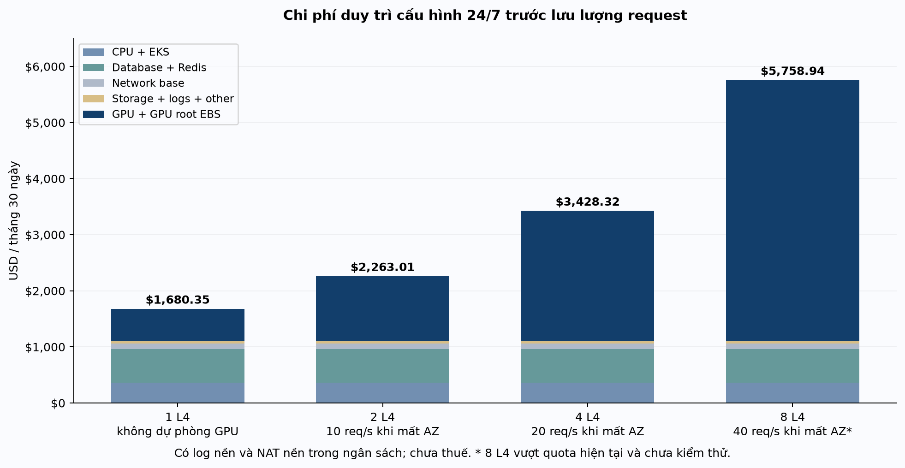
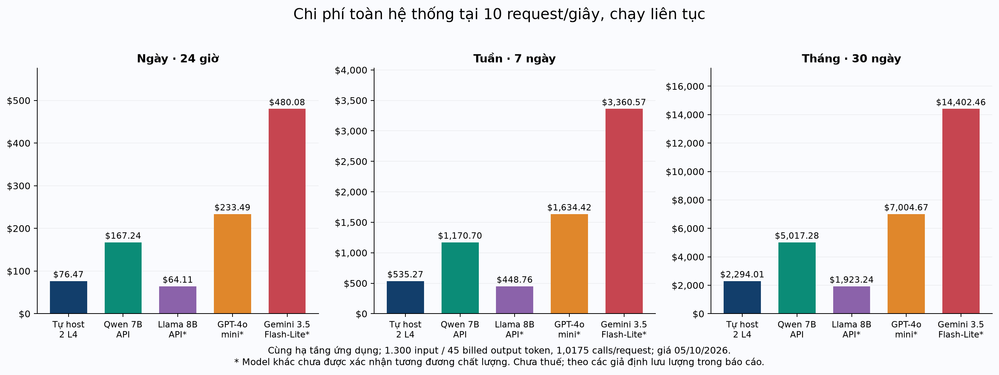
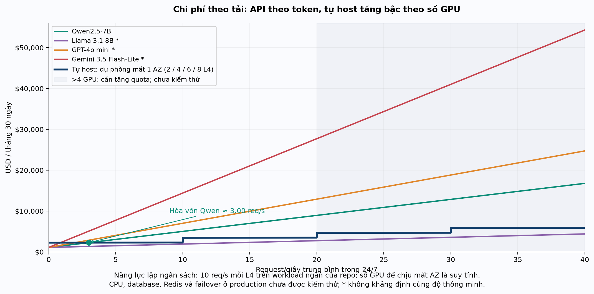

# System Cost Estimation & TCO — Production 24/7

**Hệ thống:** vllm-bench / DA51 · **Ngày chốt giá:** 05/10/2026 · **Tiền tệ:** USD · **AWS region:** us-east-1.

**Phạm vi:** hạ tầng AWS và phí inference API. Theo yêu cầu, không gồm nhân sự vận hành, phát triển và bản quyền. Tất cả số tiền trước thuế, không trừ promotional credit, không giả định Savings Plans / Reserved Instances hoặc chiết khấu hợp đồng.

## 1. Kết quả chính và mức độ chính xác

Với cấu hình production tham chiếu **P2: 2 GPU L4 + 4 CPU nodes + 2 Aurora instances + Redis có replica + mạng ở 2 AZ**, chạy liên tục, chi phí giữ cấu hình là **$2,263.01/30 ngày**. Với tải **10 user request/giây trung bình 24/7**, workload ngắn của repo và các giả định lưu lượng ở mục 5, tổng là **$76.47/ngày**, **$535.27/tuần**, **$2,294.01/tháng 30 ngày**.

| Phương án tại 10 req/s | Ngày 24 giờ | Tuần 7 ngày | Tháng 30 ngày |
| --- | --- | --- | --- |
| Tự host Qwen 7B, **2 L4**, cấu hình tham chiếu | $76.47 | $535.27 | $2,294.01 |
| Qwen2.5-7B / OpenRouter–Phala | $167.24 | $1,170.70 | $5,017.28 |
| Llama 3.1 8B / OpenRouter–DeepInfra | $64.11 | $448.76 | $1,923.24 |
| GPT-4o mini / OpenAI | $233.49 | $1,634.42 | $7,004.67 |
| Gemini 3.5 Flash-Lite / Google | $480.08 | $3,360.57 | $14,402.46 |

Các dòng API đã giữ **cùng hạ tầng ứng dụng**, bỏ GPU và root EBS GPU, cộng token, phí nền tảng, lưu secret API và lưu lượng gọi nhà cung cấp. GPT, Gemini và Llama chưa được xác nhận đạt cùng chất lượng với Qwen đang tự host; giá rẻ hơn không tự động có nghĩa là phương án thay thế phù hợp.

**Không thể xác nhận hóa đơn tương lai “chính xác tuyệt đối” khi chưa chốt tải, token thực, lưu lượng, SLA và cấu hình production.** Báo cáo này xác nhận đơn giá và phép tính chính xác theo đầu vào công khai; những đầu vào chưa đo được được đánh dấu là giả định. Số lẻ tới cent là kết quả phép tính, không phải sai số dự báo chỉ 1 cent. Không dùng chi phí lịch sử chạy lab theo giờ làm việc để suy ra production 24/7.

Ngày = 24 giờ; tuần = 168 giờ; tháng chính = **30 ngày / 720 giờ**. Số ngày/tuần trong bảng là phân bổ ngân sách tháng, bao gồm các khoản tính theo GB-tháng. Mục 8 tính riêng tháng 28/29/31 ngày; không trộn quy ước 730 giờ với 720 giờ.

## 2. Cơ sở từ hệ thống hiện tại và AWS

Đã truy cập bằng **AWS profile `vinai`**, account `043083732391`. Audit AWS cùng ngày cho thấy EC2, EKS, Aurora, NAT và load balancer chính đã tắt/xóa; đây là báo cáo **chi phí dựng lại để vận hành liên tục**, không phải chi phí tài nguyên đang chạy tại thời điểm audit. Nguồn kiểm tra account mới: kết quả STS GetCallerIdentity trong gói kiểm chứng; bằng chứng inventory: inventory audit trong gói kiểm chứng.

Model 7B trong chart là **Qwen2.5-7B-Instruct-AWQ**; báo cáo chọn mode `solo-a` trên `g6.xlarge` L4. Chart mặc định `shared` và còn model 1.5B; không coi mode mặc định này đã đạt throughput của `solo-a`. Database mặc định là Aurora PostgreSQL `db.t4g.medium`, 2 instances. CPU mặc định 2 × `m7i.large`, nodes nằm public subnet, không có NAT. Cấu hình HA của gateway/guardrail có 3 replicas và yêu cầu shared Redis. Đối chiếu trực tiếp: [vLLM values](../charts/vllm/values.yaml), [Terraform cluster](../terraform/cluster/variables.tf), [Terraform database](../terraform/data/variables.tf), [mạng lab](../terraform/core/network.tf), [HA serving](../docs/ha-serving.md).

Thông số workload lấy từ [finops_curve.py](../bench/scripts/finops_curve.py): khoảng **1.300 input token + 45 output token mỗi model call**, **1,0175 calls/user request** do retry grounding. Năng lực tham chiếu 1 L4 khoảng 10 user req/s. [Acceptance report](../docs/acceptance-report.md) ghi nhận 4 L4 phục vụ khoảng 40 req/s với p95 2.190 ms trong ramp, 2.335 ms trong steady run. README có một run khác 3 A10G; không gộp năng lực A10G vào L4. Đây là benchmark lab trên corpus/workload thử nghiệm, không chứng minh năng lực với prompt dài hoặc SLA theo tháng.

S3 API gặp `NotSignedUp`; không thể liệt kê bucket để xác nhận toàn bộ object. Cần xác nhận lại quyền/trạng thái truy cập S3 trước khi triển khai vì đường tải model weights phụ thuộc bucket này; không suy ra bucket đã bị xóa từ lỗi trên. CloudWatch của audit trước ghi nhận artifacts + state khoảng **24,576 GiB**; báo cáo dùng **25 GiB** làm mức lập ngân sách. ECR, CloudWatch Logs và ElastiCache inventory bị hạn chế IAM nên không thể xác nhận tồn dư mọi dịch vụ. Điều này không cản kiểm chứng đơn giá, nhưng cản cam kết tổng hóa đơn của toàn account. Chi tiết các lỗi/quyền trong manifest audit trong gói kiểm chứng.

## 3. Những điểm phải xử lý trước production

| Vấn đề đã thấy | Ảnh hưởng tài chính / vận hành | Cách dùng trong báo cáo |
| --- | --- | --- |
| Terraform mặc định EKS **1.31** | Đã hết standard support; EKS tổng $0.60/giờ thay vì $0.10/giờ | P2 giả định chuyển sang version còn standard support; nếu giữ extended, **cộng $12/ngày, $84/tuần, $360/30 ngày** |
| T4g Aurora dùng Unlimited | CPU credit trả thêm $0.09/vCPU-giờ khi vượt mức nền | Bản tham chiếu dùng 2 `db.r6g.large`; bản tiết kiệm ở mục 7 giữ T4g và tách credit thành biến số |
| Nodes public subnet, không NAT / ALB production | Không thể gọi cấu hình lab là deployment private có dự phòng | P2 bổ sung private nodes, 2 NAT, 1 ALB và IPv4 tương ứng |
| HA chart chỉ giải quyết gateway/guardrail | Shared Redis, inference replicas, phân bố AZ và failover phải dựng riêng | P2 lập ngân sách Redis primary/replica và 1 L4 mỗi AZ |
| `cpu_desired` / CPU node group giới hạn 3 | P2 dùng 4 CPU nodes chưa thể apply nguyên trạng | Cần sửa validation và max_size; báo cáo không sửa hoặc deploy Terraform |
| Quota G/VT hiện tại **16 vCPU** | Tối đa 4 g6.xlarge; không đủ 5/6/8 GPU | P8 là dự toán, cần tăng quota tối thiểu 32 vCPU và giới hạn node group |
| PVC Prometheus/WebUI là EBS một AZ; Tempo dùng ephemeral storage | Mất AZ có thể mất khả năng quan sát/UI hoặc dữ liệu traces | Giá PVC hiện tại được giữ; chưa tuyên bố toàn bộ UI/observability HA |
| Model 1.5B trượt grounding **133/144** gold queries | Không thể thay 7B bằng 1.5B chỉ để giảm giá | Báo cáo chính chỉ tính endpoint 7B đủ workload đã kiểm thử |
| Corpus và 7 consumers trong repo là dữ liệu/kịch bản mô phỏng | Chưa biết token, lưu lượng và tỷ lệ cache của người dùng thật | Không giả định cache giúp tiết kiệm; tải 1/5/10/20/40 là kịch bản |

EKS 1.31 hết standard support ngày 26/11/2025 và extended support ngày 26/11/2026. Chọn version đang standard support rồi duy trì lịch nâng cấp; không giả định một version giữ giá $0.10/giờ suốt 36 tháng mà không nâng cấp. [AWS EKS lifecycle](https://docs.aws.amazon.com/eks/latest/userguide/kubernetes-versions.html). Phí CPU credit Aurora được xác nhận ở [AWS Aurora pricing](https://aws.amazon.com/rds/aurora/pricing/).

**API tương đương gần nhất cũng có vấn đề cần báo ngay:** OpenRouter hiện liệt kê Qwen 7B qua một endpoint Phala, quantization là `unknown`. Trang model hiển thị availability inference 3 ngày **78,18%**, trong khi endpoint API ghi uptime 1 ngày 100%; hai metric có định nghĩa/khoảng thời gian khác nhau. Không dùng con số uptime để bỏ qua lỗi inference hoặc để cam kết SLA. Giá được xác nhận, khả năng đạt SLA/rate limit và chất lượng AWQ so với backend API chưa được xác nhận. [Qwen API page](https://openrouter.ai/qwen/qwen-2.5-7b-instruct), snapshot endpoint trong gói kiểm chứng.

## 4. Cấu hình production tham chiếu được định giá

Đây là một **phương án lập ngân sách**, chưa được triển khai hoặc load test. Giữ kiến trúc EKS + LiteLLM + guardrail + Aurora của repo, với các lựa chọn cụ thể sau:

- **2 AZ**, mỗi AZ 2 CPU nodes; tối thiểu 1 L4/AZ cho P2. Gateway/guardrail 3 replicas theo HA chart; phải thêm quy tắc phân bố ở cấp AZ và kiểm tra số pod còn lại khi failover.
- **2 × Aurora `db.r6g.large`** và **2 × Redis `cache.m7g.large`**, engine còn standard support, không burst. Chọn loại này để tách dự toán cơ sở khỏi Aurora CPU credit; không có bằng chứng workload bắt buộc phải dùng kích thước này. Redis mỗi node 6,38 GiB; hai node là replica của một dữ liệu, không phải 12,76 GiB capacity độc lập.
- GPU inference ở private subnet; **2 NAT Gateway zonal**, route cùng AZ, S3 gateway endpoint để model weights không đi qua NAT. P2 không tính thêm 5 interface endpoints cùng lúc vì đã chọn NAT làm đường egress.
- **1 internet-facing ALB** ở 2 AZ, kết thúc TLS rồi gọi gateway; giả định ALB cần 2 public IPv4, NAT cần 2 EIP. Nếu ALB scale thêm IP, phí tăng theo IP thực tế.
- EBS gp3 baseline 3.000 IOPS / 125 MiB/s; chưa mua IOPS/throughput bổ sung. NVMe instance store GPU đã nằm trong giá EC2; không cộng thêm thành EBS.
- Log metadata/control-plane có retention 30 ngày; không log prompt/answer chứa dữ liệu nhạy cảm. Các metric chính vẫn có thể dùng Prometheus; bảng chỉ tính 20 custom CloudWatch metrics và 10 alarms trả phí.

Failover database/Redis có thời gian gián đoạn; P2 là topology dự phòng, **không phải cam kết không downtime hoặc SLA 99,9%**. Giá ứng dụng API giữ cùng database/cache/network để đo riêng quyết định inference. Nếu thiết kế lại sang serverless/API Gateway hoặc bỏ EKS thì cần một BOM khác, không được gán giá này cho kiến trúc đó.

### Bill of Materials P2 — 24/7

| Thành phần | Số lượng / giả định | Đơn giá USD | USD / tháng 30 ngày |
| --- | --- | --- | --- |
| GPU inference L4 | 2 × g6.xlarge, mỗi máy 1 GPU | $0.8048 / máy-giờ | $1,158.91 |
| CPU ứng dụng + Grafana/Prometheus/Alertmanager | 4 × m7i.large, dùng chung | $0.1008 / máy-giờ | $290.30 |
| EKS control plane | 1 cluster, STANDARD support | $0.10 / giờ | $72.00 |
| Aurora PostgreSQL Standard | 2 × db.r6g.large; writer + failover reader | $0.260 / instance-giờ | $374.40 |
| Shared Redis | 2 × cache.m7g.large; primary + replica | $0.158 / node-giờ | $227.52 |
| NAT Gateway | 2, mỗi AZ một NAT | $0.045 / gateway-giờ | $64.80 |
| ALB phần giờ | 1 ALB ở 2 AZ | $0.0225 / ALB-giờ | $16.20 |
| Public IPv4 | 2 NAT EIP + 2 IPv4 của ALB | $0.005 / IP-giờ | $14.40 |
| EBS gp3 root CPU | 4 × 30 GiB = 120 GiB | $0.08 / GiB-tháng | $9.60 |
| EBS gp3 root GPU | 2 × 40 GiB = 80 GiB | $0.08 / GiB-tháng | $6.40 |
| EBS gp3 PVC | Prometheus 20 + WebUI 4 = 24 GiB | $0.08 / GiB-tháng | $1.92 |
| S3 Standard | 25 GiB; gồm artifacts + state | $0.023 / GiB-tháng | $0.58 |
| ECR private | 2 GiB images | $0.10 / GiB-tháng | $0.20 |
| Aurora storage | 10 GiB cho cluster; không nhân đôi theo replica | $0.10 / GiB-tháng | $1.00 |
| Aurora backup trả phí | 10 GiB **vượt** phần backup miễn phí | $0.021 / GiB-tháng | $0.21 |
| Secrets Manager | 3 secrets | $0.40 / secret-tháng | $1.20 |
| CloudWatch metric / alarm | 20 custom metrics + 10 standard alarms | $0.30 / metric; $0.10 / alarm-tháng | $7.00 |
| Log nền ứng dụng + control plane | 30 GiB ingest; 30 GiB lưu, steady state 30 ngày | $0.50 ingest; $0.03 lưu / GiB-tháng | $15.90 |
| NAT processing nền | 10 GiB / 30 ngày | $0.045 / GiB | $0.45 |
| S3 / secret requests nền | 1.000 PUT, 10.000 GET, 1.000 secret reads | Theo đơn giá request | $0.01 |
| **Tổng giữ cấu hình, trước request người dùng** | 24/7, 720 giờ |  | **$2,263.01** |

Đơn giá AWS machine/service được kiểm tra bằng `pricing get-products --profile vinai` và SKU cụ thể. Xem bảng đơn giá tại mục 13, chi tiết SKU/rate code tại mục 13, lệnh và thời gian truy vấn trong gói kiểm chứng. Các dòng IPv4, Secrets Manager và S3 requests đối chiếu [VPC pricing](https://aws.amazon.com/vpc/pricing/), [Secrets pricing](https://aws.amazon.com/secrets-manager/pricing/), [S3 pricing](https://aws.amazon.com/s3/pricing/).

**Phần giữ cấu hình là $2,263.01/30 ngày**: $1,097.69 chung cho ứng dụng + $1,165.31 cho 2 GPU và root disk. Trong đó $15,90 log nền và $0,45 NAT nền là ngân sách theo lưu lượng giả định, không phải phí cố định pháp định của AWS.



## 5. Biến phí theo lưu lượng và công thức tái tính

Những số đo chưa có ở production không được điền bằng zero rồi gọi là “đầy đủ”. Bảng dưới quy định đầu vào cho **kịch bản chuẩn**; thay các đầu vào này sẽ thay chi phí:

| Đầu vào | Giá trị đang dùng | Trạng thái |
| --- | --- | --- |
| Tải người dùng | 1/5/10/20/40 req/s trung bình suốt 24/7 | Kịch bản; chưa có số production |
| Input / output mỗi model call | 1.300 / 45 token | Tham chiếu benchmark, không đại diện copilot trả lời dài |
| Calls / user request | 1,0175 | Tham chiếu retry của repo; không đo được cho từng API |
| Cache hit | 0% | So sánh không dựa vào cache chưa chứng minh |
| Log request | 1 KiB/user request; lưu đủ 30 ngày | Giả định metadata, chưa đo/compression thực |
| ALB bytes mỗi user request | 8 KiB vào + 2 KiB ra | Giả định, không suy ra chính xác từ token |
| ALB connections | 1 TLS connection mới/request; sống ≤3 giây; ≤10 rules | Giả định bảo thủ, không connection reuse |
| Internet egress đến client | 2 KiB/user request | Giả định, tính $0.09/GiB trước allowance |
| Cross-AZ chung | 16 KiB/user request **tổng ở các phía EC2 bị tính phí** | Giả định đã quy về bytes billable, không tự nhân đôi lần nữa |
| Cross-AZ inference self-host | 8 KiB/model call tổng ở phía bị tính phí | Giả định topology, không tính ALB cross-zone được miễn phí vào đây |
| AWS → API external | NAT hai chiều 8 KiB/call; outbound internet 6 KiB/call | Giả định, cộng thêm ngoài đường trả lời client |
| Aurora storage I/O | 1 billable storage I/O/user request | Giả định; **không phải** 1 SQL query = 1 I/O |
| S3 / ECR / DB / backup | 25 / 2 / 10 / 10 GiB billable | Mức kế hoạch giữ ổn định, chưa dự báo tăng trưởng |

AWS ghi “GB” trong nhiều price dimensions; tính bytes ở đây quy về **2³⁰ bytes**. EBS provisioned volumes và CloudWatch snapshot của repo dùng GiB. Phải đối chiếu CUR UsageAmount/billed bytes sau triển khai; không dùng quy ước 1 GB = 10⁹ bytes cho một bên rồi so sánh với 2³⁰ ở bên kia.

Với `r` là user req/s và `d` là ngày:

```text
N_user = r × 86.400 × d
N_model_calls = N_user × 1,0175 × (1 - application_cache_hit)

API_token_USD = N_model_calls ×
               (input_tokens × price_input + billed_output_tokens × price_output) / 1.000.000

Self_host_USD = common_app_cost + GPU_count × (EC2_GPU + GPU_root_EBS)
               + request-dependent common costs + inference cross-AZ

API_system_USD = common_app_cost + request-dependent common costs
                + API_token_USD + platform_fee + API_secret
                + API NAT processing + API internet egress
```

Trong kịch bản hiện tại, ALB LCU theo `max(r/25, r×3.600×10KiB/2³⁰, r×3/3.000, 0)`; connection dimension lớn nhất. Giá = LCU × $0.008 × giờ, cộng ALB base đã có trong BOM. Không mặc định làm tròn lên 1 LCU cho tải nhỏ. [ALB pricing / định nghĩa LCU](https://aws.amazon.com/elasticloadbalancing/pricing/).

### Biến phí self-host P2 tại 10 req/s

| Biến phí tại 10 req/s | Ngày | Tuần | Tháng 30 ngày |
| --- | --- | --- | --- |
| ALB LCU | $0.08 | $0.54 | $2.30 |
| Request logs | $0.44 | $3.06 | $13.10 |
| Aurora storage I/O | $0.17 | $1.21 | $5.18 |
| Client internet egress | $0.15 | $1.04 | $4.45 |
| Common inter-AZ, aggregated billable-side bytes | $0.13 | $0.92 | $3.96 |
| Cross-AZ inference, tổng bytes ở các phía bị tính phí | $0.07 | $0.47 | $2.01 |
| **Tổng biến phí** | **$1.03** | **$7.23** | **$31.01** |

Vì vậy **$2,263.01 + $31.01 = $2,294.01/30 ngày**. Chi phí API network riêng tại 10 req/s là $22.64/30 ngày; secret nhà cung cấp + reads là $0,405/30 ngày.

AWS có 100 GB internet outbound miễn phí mỗi tháng cho cả account; allowance này có thể đã được dịch vụ khác sử dụng. Báo cáo **không trừ** allowance để không phụ thuộc account dùng chung. Nếu còn đủ allowance, mức giảm tối đa ở tier đầu là khoảng $9/tháng; NAT processing vẫn trả phí. [AWS EC2 data transfer](https://aws.amazon.com/ec2/pricing/on-demand/).

## 6. “Cùng độ thông minh”: bằng chứng và giới hạn so sánh

**Đối chiếu chính là Qwen2.5-7B-Instruct qua API với cùng checkpoint family.** Self-host dùng AWQ, OpenRouter–Phala không công bố quantization ở endpoint snapshot, nên chưa thể khẳng định output hay accuracy giống nhau. Các API model khác chỉ trở thành tương đương cho hệ thống này khi đạt cùng chuẩn đánh giá nghiệp vụ.

Một đối chiếu cùng bộ benchmark do Qwen công bố cho instruct models:

| Model | MMLU-Pro | MMLU-redux | HumanEval | IFEval strict-prompt |
| --- | --- | --- | --- | --- |
| Qwen2.5-7B-Instruct | 56,3 | 75,4 | 84,8 | 71,2 |
| Llama3.1-8B-Instruct | 48,3 | 67,2 | 72,6 | 75,9 |
| GPT-4o mini | 63,1 | 81,5 | 88,4 | 80,4 |

Các điểm này khác nhau theo nhiệm vụ: Llama yếu hơn ở nhiều cột nhưng IFEval cao hơn; GPT mini cao hơn trong bảng này. Không suy ra “cùng thông minh” từ số tham số, giá token hoặc một điểm tổng hợp. Đây là đánh giá nhà sản xuất, không phải benchmark production của dự án. [Qwen instruction-tuned evaluations](https://qwenlm.github.io/blog/qwen2.5-llm/). Với Gemini 3.5 Lite, chưa có kết quả cùng protocol trong repo để đặt ngang hàng; không điền điểm giả định.

Để xác nhận thay thế, cần chạy cùng gold set, cùng retrieval context và guardrail: tỷ lệ câu trả lời đúng/đủ, grounded citations, từ chối đúng, PII/prompt-injection, tiếng Việt, tool/JSON nếu dùng; đồng thời đo p95, lỗi/429, token billable và retry từng model. Giữ prompt/sampling/snapshot cụ thể. Bộ 144 gold queries hiện tại hữu ích cho hồi quy, nhưng corpus mô phỏng không thay cho dữ liệu nghiệp vụ thật. Chi phí trên **câu trả lời đạt chuẩn** phải là tổng chi phí chia số câu trả lời đạt chuẩn, không chia tổng request gửi.

### Đơn giá API được kiểm tra ngày 05/10/2026

| Model / API | Input / 1M token | Output / 1M token | Phí nền tảng | USD / 1.000 user requests chuẩn | Nguồn |
| --- | --- | --- | --- | --- | --- |
| Qwen2.5-7B / OpenRouter–Phala | $0.100 | $0.200 | 5,5% | $0.15 | [Đơn giá](https://openrouter.ai/qwen/qwen-2.5-7b-instruct) |
| Llama 3.1 8B / OpenRouter–DeepInfra | $0.020 | $0.040 | 5,5% | $0.03 | [Đơn giá](https://openrouter.ai/meta-llama/llama-3.1-8b-instruct) |
| GPT-4o mini / OpenAI | $0.150 | $0.600 | 0% trong phép tính | $0.23 | [Đơn giá](https://developers.openai.com/api/docs/models/gpt-4o-mini) |
| Gemini 3.5 Flash-Lite / Google | $0.300 | $2.500 | 0% trong phép tính | $0.51 | [Đơn giá](https://ai.google.dev/gemini-api/docs/pricing) |
| Gemini 2.5 Flash-Lite / Google (legacy access) | $0.100 | $0.400 | 0% trong phép tính | $0.15 | [Đơn giá](https://ai.google.dev/gemini-api/docs/pricing) |
| Qwen2.5-7B Turbo / Together (catalog only) | $0.300 | $0.300 | 0% trong phép tính | $0.41 | [Đơn giá](https://www.together.ai/models/qwen2-5-7b-instruct-turbo) |

Giá token OpenRouter–Phala và OpenRouter–DeepInfra lấy từ **endpoint cụ thể**, không lấy giá tổng hợp có thể cache/chọn route khác. Qwen endpoint snapshot trong gói kiểm chứng, Llama endpoint snapshot trong gói kiểm chứng. Standard OpenRouter có phí mua credit **5,5%**; báo cáo dùng số tiền nạp tương ứng inference tiêu thụ, phí được phân bổ vào đơn giá. Phí tối thiểu/method/crypto/Business có thể khác; phí mua credit thực phải đối chiếu giao dịch. Business hiện 8%, Enterprise giá hợp đồng. [OpenRouter pricing](https://openrouter.ai/pricing).

Không dùng giá cached-input hoặc Batch trong baseline synchronous 24/7. Với tokenizer khác, “1.300/45 token” là **chuẩn hóa số token billable**, không bảo đảm cùng một văn bản sẽ có đúng số token đó ở mọi model. Gemini tính cả thinking tokens trong output; 45 ở đây phải là **tổng output bị tính tiền**, không chỉ 45 token người dùng nhìn thấy. Nếu thinking không tắt được hoặc trả dài, phải đổi input. Không thêm Google Search/Maps hay tools trả phí vào workload RAG nội bộ này. [Google pricing](https://ai.google.dev/gemini-api/docs/pricing), [OpenAI model pricing](https://developers.openai.com/api/docs/models/gpt-4o-mini).

**Hai dòng chỉ tham khảo:** Gemini 2.5 Flash-Lite chưa công bố shutdown nhưng Google đang hạn chế các model 2.5 cho tài khoản đã dùng trước; new project nên dùng model mới. Together vẫn có trang Qwen2.5-7B Turbo ($0.30/$0.30, FP8), nhưng không thấy endpoint này trong danh sách serverless hiện tại và các endpoint Qwen2.5 khác đã có lịch deprecation; chưa gọi thử vì không có API credential. Hai dòng này không dùng làm phương án production chính hay trong biểu đồ. [Google deprecations](https://ai.google.dev/gemini-api/docs/deprecations), [Together model](https://www.together.ai/models/qwen2-5-7b-instruct-turbo), [Together available models](https://docs.together.ai/docs/serverless/models), [Together deprecations](https://docs.together.ai/docs/deprecations).

### Chi phí inference API riêng — 10 req/s, 24/7

| API: chỉ token + phí nền tảng, tại 10 req/s | Ngày | Tuần | Tháng 30 ngày |
| --- | --- | --- | --- |
| Qwen2.5-7B / OpenRouter–Phala | $128.92 | $902.43 | $3,867.56 |
| Llama 3.1 8B / OpenRouter–DeepInfra | $25.78 | $180.49 | $773.51 |
| GPT-4o mini / OpenAI | $195.16 | $1,366.15 | $5,854.94 |
| Gemini 3.5 Flash-Lite / Google | $441.76 | $3,092.30 | $13,252.73 |

Bảng trên **chỉ token + phí nền tảng**. Bảng kết quả mục 1 đã cộng hạ tầng và network; không cộng hai bảng vào nhau. 10 req/s tương ứng **864.000 user requests/ngày**, **6.048.000/tuần**, **25.920.000/30 ngày**. Model calls: **26.373.600/30 ngày**; input **34.285.680.000 token**, billed output **1.186.812.000 token**. Nhu cầu tức thời khoảng **610,5 RPM**, **793.650 input TPM**, **27.472,5 output TPM**. Nhà cung cấp phải cho phép giới hạn này; list price không bảo đảm capacity hoặc p95.



## 7. Số GPU, dự phòng và bảng chi phí theo tải

Trong các profile dưới, hạ tầng chung giữ như BOM P2; số GPU thay đổi. Mức 10 req/s/L4 lấy từ **workload ngắn đã đo**, không dùng cho output 1.000 token. P2/P4 phân bố AZ là lựa chọn thiết kế chưa được kiểm thử; P8 vượt tài nguyên đã kiểm thử và quota hiện tại. Tải còn lại khi lỗi là năng lực suy tính sau khi failover hoàn tất, không bao hàm thời gian phục hồi.

| Profile | L4 / phân bố AZ | Tải bình thường tham chiếu | Còn khi mất 1 GPU | Còn khi mất 1 AZ | Ngày giữ cấu hình | Tuần | Tháng |
| --- | --- | --- | --- | --- | --- | --- | --- |
| P1 | 1 / 1 + 0 | ~10 req/s | ~0 req/s | ~0 req/s | $56.01 | $392.08 | $1,680.35 |
| P2 | 2 / 1 + 1 | ~20 req/s | ~10 req/s | ~10 req/s | $75.43 | $528.03 | $2,263.01 |
| P4 | 4 / 2 + 2 | ~40 req/s | ~30 req/s | ~20 req/s | $114.28 | $799.94 | $3,428.32 |
| P8 | 8 / 4 + 4 | ~80 req/s | ~70 req/s | ~40 req/s | $191.96 | $1,343.75 | $5,758.94 |

**P4 có thể tham chiếu 40 req/s lúc bình thường, nhưng chỉ còn ~20 req/s khi mất 1 AZ.** Muốn giữ đủ 40 req/s khi mất AZ theo năng lực này cần ít nhất 4 GPU/AZ = 8 GPU; không thể dùng bảng 4 GPU để hứa HA 40 req/s. Nếu chỉ yêu cầu mất 1 GPU thì tối thiểu 5 L4; quota hiện tại cũng chưa đủ. CPU/database/cache phải kiểm thử lại ở topology tương ứng.

### Tổng chi phí 30 ngày, với mục tiêu giữ tải khi mất một AZ

| req/s 24/7 | L4 để giữ tải khi mất AZ | Request / 30 ngày | Tự host | Qwen API | Llama API* | GPT-4o mini* | Gemini 3.5 Lite* |
| --- | --- | --- | --- | --- | --- | --- | --- |
| 1 | 2 | 2,592,000 | $2,266.11 | $1,490.02 | $1,180.61 | $1,688.75 | $2,428.53 |
| 5 | 2 | 12,960,000 | $2,278.51 | $3,057.69 | $1,510.67 | $4,051.38 | $7,750.28 |
| 10 | 2 | 25,920,000 | $2,294.01 | $5,017.28 | $1,923.24 | $7,004.67 | $14,402.46 |
| 20 | 4 | 51,840,000 | $3,490.33 | $8,936.47 | $2,748.38 | $12,911.24 | $27,706.83 |
| 40 | 8 | 103,680,000 | $5,882.96 | $16,774.85 | $4,398.66 | $24,724.38 | $54,315.56 |

`*` = khác model, chưa đạt chứng nhận chất lượng tương đương. Các dòng 20/40 req/s là dự toán năng lực và chi phí với lượng token cố định, không phải xác nhận provider đã cấp rate limit. 20 req/s dùng P4; 40 req/s dùng P8. Hệ thống chạy 24/7 nhưng request chỉ có 8 giờ/ngày sẽ có **tải trung bình bằng 1/3 tải khi có người dùng**, trong khi GPU giữ nguyên vẫn trả đủ ngày; không lấy peak rps làm average rps để phóng đại tiết kiệm.



### Nếu giữ database và cache loại nhỏ

Thay 2 `db.r6g.large` bằng 2 `db.t4g.medium` giảm **$269,28/30 ngày**. Thay 2 `cache.m7g.large` bằng 2 `cache.t4g.small` giảm **$181,44/30 ngày**. Tổng giảm **$450,72/30 ngày = $15,024/ngày = $105,168/tuần**. P2 ở 10 req/s khi đó là **$1,843.29/30 ngày + Aurora CPU credit thực**, cùng các giả định lưu lượng.

Đây là một phương án tiết kiệm có điều kiện, không mặc định rằng database/cache lớn hơn là bắt buộc. CPU credit Aurora bổ sung = **charged vCPU-hours × $0.09**; mỗi 100 charged vCPU-hours thêm $9. Redis T4g 1,37 GiB/node có khả năng burst/throttle và giới hạn cache; cần đo CPU/cache memory/evictions/latency. Replica không tăng gấp đôi dung lượng usable. Phần giảm này áp dụng cho cả self-host và API nếu hai bên dùng cùng app infrastructure, nên không tự đổi điểm hòa vốn inference.

### Chi phí nếu chỉ bật lại lab như trước

Ví dụ 1 L4 + 2 m7i.large + 2 db.t4g.medium + EKS 1.31 extended + 3 node public IPv4: phần chạy theo giờ là **$1,7674/giờ = $42,4176/ngày = $296,9232/tuần = $1.272,528/720 giờ**, **chưa** EBS/S3/ECR/storage/I/O/CPU credit. Số này giúp thấy ảnh hưởng của cấu hình hiện có nhưng **không phải tổng production**: thiếu shared Redis, NAT/ALB, dự phòng inference, logging production và capacity lúc mất AZ. Nếu nâng EKS về standard support, riêng phí giờ giảm $360/30 ngày.

### Nếu giữ cả endpoint Qwen 1.5B

P2 đang dành 2 GPU cho riêng 7B `solo-a`. Thêm 1.5B **dedicated và HA ở 2 AZ** cần 2 GPU nữa theo phương án đơn giản này, thêm **$38.84/ngày, $271.91/tuần, $1,165.31/30 ngày**, chưa biến phí endpoint 1.5B. Chạy chung hai model trên cùng GPU là phương án khác, không được kế thừa năng lực 10 req/s của `solo-a`; chart mặc định `shared` không tự cho throughput tương đương. Vấn đề grounding của 1.5B phải giải quyết trước khi chọn model này cho MOC.

## 8. Tháng lịch, TCO 12/36 tháng và cash flow

### Chi phí P2 tại 10 req/s theo độ dài tháng

| Độ dài tháng | Compute giờ | P2 tại 10 req/s |
| --- | --- | --- |
| 28 | 672 | $2,142.98 |
| 29 | 696 | $2,218.50 |
| 30 | 720 | $2,294.01 |
| 31 | 744 | $2,369.53 |

Tháng 10/2026 có 31 ngày / 744 giờ, nếu chạy trọn tháng theo giả định P2 thì **$2,369.53**. Calendar table giữ storage provisioned, retained log steady state và metric theo GB-tháng/metric-tháng; phần giờ, log ingest, request và throughput theo ngày thật. Nếu triển khai giữa tháng hoặc retention chưa đầy, invoice storage/log tháng đầu sẽ khác.

### TCO hạ tầng/API, giá và tải giữ nguyên

| Phương án | 30 ngày | 12 tháng / 365 ngày | 36 tháng / 1.096 ngày |
| --- | --- | --- | --- |
| P2 self-host / 10 req/s | $2,294.01 | $27,905.71 | $83,792.64 |
| P4 self-host / 40 req/s, mất AZ còn ~20 | $3,552.34 | $43,213.95 | $129,759.02 |
| P8 self-host / 40 req/s, dự phòng AZ chưa kiểm thử | $5,882.96 | $71,567.74 | $214,897.65 |
| Qwen2.5-7B / OpenRouter–Phala / 10 req/s | $5,017.28 | $61,039.94 | $183,286.33 |
| Llama 3.1 8B / OpenRouter–DeepInfra / 10 req/s | $1,923.24 | $23,395.73 | $70,250.55 |
| GPT-4o mini / OpenAI / 10 req/s | $7,004.67 | $85,219.76 | $255,892.04 |
| Gemini 3.5 Flash-Lite / Google / 10 req/s | $14,402.46 | $175,226.27 | $526,158.15 |

Kỳ dự phóng 12 tháng từ 05/10/2026 đến 05/10/2027 là **365 ngày / 8.760 giờ**; 36 tháng đến 05/10/2029 là **1.096 ngày / 26.304 giờ**, có ngày nhuận 2028. TCO gồm 12/36 tháng storage/metric giữ nguyên, giờ và throughput theo số ngày thật; không tính “12 × 30 ngày” thành năm. Đây là tổng danh nghĩa, chưa chiết khấu dòng tiền, không quy đổi USD/VND.

Với On-Demand và list-price API, mô hình không có commitment/upfront purchase bắt buộc. OpenRouter là **prepaid credit**: tiền nạp là cash outflow, inference consumption là chi phí sử dụng, credit chưa tiêu thụ là số dư; không cộng cả tiền nạp và token consumption thành hai chi phí. Phí nạp được tính một lần theo mức giả định. Model weights đã có không cộng lại chi phí đào tạo; chưa có số lượng/tần suất training/fine-tune trong production.

Startup/rolling update/test traffic có thể làm thêm instance-hours, NAT image pulls, S3 GET hoặc EBS overlap. Không có dữ liệu để chốt khoản một lần; ghi bổ sung theo usage thực. Ví dụ giữ thêm 1 L4 2 giờ thêm **$1,6096 tiền EC2**, disk/network tính riêng. Future API/AWS prices và lịch deprecation không được bảo đảm 36 tháng; TCO là **giá tại ngày chốt giữ nguyên**, không phải báo giá hợp đồng cho 3 năm.

## 9. Điểm hòa vốn và cách đọc tiết kiệm

So sánh cùng app infrastructure, phần chung triệt tiêu. Hòa vốn P2 dùng **2 GPU bật suốt ngày**, cộng root EBS và network inference; phía API cộng fee, secret, NAT/egress. Không so một hóa đơn AWS toàn hệ thống với chỉ token API rồi gọi đó là tiết kiệm.

| Đối chiếu P2 | Hòa vốn: req/s trung bình 24/7 | User requests / ngày tại hòa vốn | Kết luận chất lượng |
| --- | --- | --- | --- |
| Qwen2.5-7B / OpenRouter–Phala | 2.9960 | 258,856 | Cùng checkpoint; cần kiểm tra AWQ / backend API |
| Llama 3.1 8B / OpenRouter–DeepInfra | 14.6689 | 1,267,390 | Chưa xác nhận tương đương; chỉ tham khảo tài chính |
| GPT-4o mini / OpenAI | 1.9826 | 171,299 | Chưa xác nhận tương đương; chỉ tham khảo tài chính |
| Gemini 3.5 Flash-Lite / Google | 0.8776 | 75,827 | Chưa xác nhận tương đương; chỉ tham khảo tài chính |

Đối chiếu gần nhất Qwen: P2 bắt đầu rẻ hơn khi tải trung bình khoảng **3.00 req/s**, tương đương **258,856 user requests/ngày**, với 1.300/45 token, 1,0175 calls/request, cache 0% và fee 5,5%. Đây là hòa vốn tài chính; điểm này không chứng minh SLA hay chất lượng model API. Tại 10 req/s, P2 thấp hơn hệ thống Qwen API **$2,723.27/30 ngày**, khoảng **54.3% tổng chi phí hệ thống**.

Hòa vốn Llama khoảng 14,67 req/s vượt khả năng P2 giữ tải khi mất AZ (~10 req/s). Khi tăng GPU để bảo đảm dự phòng, phải giải lại điểm hòa vốn ở bậc mới; không quảng bá con số 14,67 như lời hứa self-host P2 phù hợp production ở tải đó. Llama cũng chưa tương đương chất lượng. Tỷ lệ tiết kiệm phải ghi rõ denominator là **toàn hệ thống** hay **inference riêng**; không dùng hai tỷ lệ thay thế nhau.

## 10. Độ nhạy với câu trả lời dài và agent nhiều bước

| Input / billed output mỗi call | Calls / user request | Qwen API: USD / 1.000 requests | GPT-4o mini | Gemini 3.5 Lite |
| --- | --- | --- | --- | --- |
| 1,300 / 45 | 1.0175 | $0.15 | $0.23 | $0.51 |
| 1,300 / 256 | 1.0175 | $0.19 | $0.35 | $1.05 |
| 1,300 / 1,000 | 1.0175 | $0.35 | $0.81 | $2.94 |
| 4,000 / 1,000 | 1.0175 | $0.64 | $1.22 | $3.76 |
| 1,300 / 45 | 3 | $0.44 | $0.67 | $1.51 |

Đây là chi phí token + fee được chuẩn hóa, chưa network/app. Với 1.300 input / 1.000 output, API Qwen riêng tăng **2.37 lần** so với 45 output; GPT mini tăng **3.58 lần**. Ba calls/user request tăng cả token và model compute, không chỉ phía API. **Không giữ nguyên 10 req/s/L4 trong các workload dài này**; phải đo lại throughput, KV cache và số GPU rồi mới so TCO. Gemini thinking tokens, các lần tool calling và failed/partial generations có thể làm billable output/calls tăng.

Cache ứng dụng 30% có thể giảm số model calls tới khoảng 70% nếu cache đúng và không làm mất chất lượng; GPU đã provision vẫn trả nguyên tiền trừ khi giảm số node. Prompt cache của provider chỉ giảm **phần input đủ điều kiện**, không đồng nghĩa giảm 30% tổng request/API bill. Corpus thật, phân bố length và cold-cache traffic là những dữ liệu còn thiếu quan trọng nhất.

## 11. Phạm vi chưa nằm trong con số tổng

Các tổng trên bao phủ đúng BOM và giả định đã ghi. Những dịch vụ/khối lượng dưới đây chưa có deployment hay số đo để định giá tổng; nếu production yêu cầu thì phải bổ sung, không coi chi phí của chúng là đã bao gồm:

| Hạng mục | Cách xử lý |
| --- | --- |
| Thuế, phí thanh toán/FX, điều khoản credit hoặc Enterprise | Chưa có invoice/hợp đồng; số báo cáo trước thuế USD, cần đối chiếu billing entity |
| AWS Support trả phí | Chưa xác nhận plan; chỉ giả định không cộng premium support |
| WAF, CloudFront, domain/DNS/Route53, VPN/Direct Connect, private API ingress | Chưa có cấu hình/nghiệp vụ mạng được chốt; ALB public hiện là reference |
| KMS customer-managed key và lượng crypto requests | Giả định AWS-managed encryption; nếu chọn CMK phải thêm key/request charges |
| Persistent traces, managed observability, log query volume, managed Prometheus/Grafana | Chỉ tính PVC và số logs/metrics đã nêu; không coi chart ephemeral là hệ quan sát production HA |
| Cross-region DR, DR database/Redis, S3 replication, restore exercises | Reference chỉ 2 AZ trong 1 region, không có DR region |
| EBS snapshots, backup growth trên 10 GiB billable, S3/ECR lifecycle và nhiều bản image/model | Chưa đo; không có tăng trưởng tự động trong TCO |
| Hybrid/dense retrieval embedding hoặc indexing mới | Pipeline hiện dense disabled; nếu bật TEI/API embedding phải sizing/định giá lại; không gọi 7B GPU là phí cả embedding |
| Training/fine-tune, staging/dev chạy song song, CI runners/load-generator | Chưa nằm trong serving workload, thêm theo machine-hours/token/job thực |
| GPU/node overlap khi rollout và burst capacity | Replica/max_surge/rollout duration phải xác định; quota 16 vCPU có thể không cho overlap P4 |
| Capacity reservation/provisioned API throughput/Enterprise SLA | Chưa có báo giá; list price serverless không bao gồm cam kết throughput |

Các quyền invoice/credit/CUR và inventory từng dịch vụ trong audit bị hạn chế, nên không chứng nhận report này là tổng mọi khoản account AWS sẽ trả. Promotional credits lịch sử đã bù gần hết hóa đơn lab không được chuyển thành chi phí production $0. Mọi khoản trên được tách vì chưa có thông tin thực, không phải khẳng định chắc chắn tất cả đều cần mua.

## 12. Kết luận để lập ngân sách và điều kiện chốt

Đối với **10 req/s trung bình 24/7**, có thể dùng **$2,294.01/30 ngày** làm ngân sách tham chiếu cho P2 non-burst theo BOM. Nếu thử nghiệm xác nhận Aurora/Redis nhỏ đủ tải, bản lean còn **$1,843.29/30 ngày + CPU credit**. Nếu muốn giữ **40 req/s khi mất AZ**, mức tham chiếu P8 là **$5,882.96/30 ngày** và cần tăng quota, sửa giới hạn node group, load/failover test.

API Qwen cùng checkpoint là đối chiếu chi phí sát nhất: tại 10 req/s cùng hạ tầng, **$5,017.28/30 ngày**, nhưng chỉ có một endpoint và có cảnh báo availability; chưa nên kết luận chọn production chỉ dựa vào giá. GPT mini/Gemini/Llama là lựa chọn thử nghiệm thêm, không được ghi “cùng độ thông minh” khi chưa đạt cùng chuẩn nghiệp vụ.

Để biến dự toán thành số có thể phê duyệt theo workload thật cần chốt **tải trung bình và đỉnh**, **token/calls p50/p95 của user thật**, **yêu cầu mất GPU/AZ/SLA**, và **chọn BOM lean hay non-burst**. Sau đó thu flow/log/storage/IO/CPU-credit metrics, xác nhận rate limit từng API, đánh giá chất lượng cùng gold set và đối soát CUR/invoice tháng đủ dữ liệu. Không thay đổi hay dựng thêm resource AWS trong quá trình làm báo cáo.

## 13. Nguồn và kiểm chứng

Đã kiểm tra đơn giá AWS bằng Price List API qua profile `vinai` ngày 05/10/2026; tài khoản `043083732391`, region us-east-1. Bảng dưới giữ lại đơn giá và SKU đã dùng. Các biến về số node, dung lượng, token và lưu lượng nằm trong BOM/công thức của báo cáo.

| Rate trong mô hình | USD / đơn vị | Đơn vị AWS | SKU |
| --- | --- | --- | --- |
| `gpu` | .8048 | Hrs | `TPKUC6XYSUQ3VFK2` |
| `cpu` | .1008 | Hrs | `HDXWAGH5PKCWGFHZ` |
| `eks` | .1 | Hours | `ZYWMR684YSMFHWEU` |
| `eks_extra` | .5 | hours | `M7977BSVFGDUJZ67` |
| `db` | .26 | Hrs | `4U9P9G87PY8QVQH5` |
| `db_lean` | .073 | Hrs | `ZWNRVFAVVGZ57657` |
| `redis` | .158 | Hrs | `3GVF2GRNVGCHRPSP` |
| `redis_lean` | .032 | Hrs | `BYFG57CPZSFUXSSY` |
| `nat_h` | .045 | Hrs | `M2YSHUBETB3JX4M4` |
| `nat_gb` | .045 | GB | `59S5R83GFPUAGVR5` |
| `alb_h` | .0225 | Hrs | `37CUWUT8GSNQEPUV` |
| `alb_lcu` | .008 | LCU-Hrs | `P2XGEJ8N3KU52WA8` |
| `ebs` | .08 | GB-Mo | `JG3KUJMBRGHV3N8G` |
| `s3` | .023 | GB-Mo | `WP9ANXZGBYYSGJEA` |
| `ecr` | .1 | GB-Mo | `KJC988R4J65BDMTQ` |
| `db_storage` | .1 | GB-Mo | `7GYUVAA992PFJPCB` |
| `db_io` | .0000002 | IOs | `7JDSZP38DMKT9B86` |
| `db_backup` | .021 | GB-Mo | `AYEW6PNFPJSSTGH7` |
| `db_credit` | .09 | vCPU-Hours | `AATQPUVWSQQXCS6S` |
| `logs_in` | .5 | GB | `S8QGXX5R2BKKMDSJ` |
| `logs_store` | .03 | GB-Mo | `6K9ADYQAHV5KX9KZ` |
| `metrics` | .3 | Metrics | `KG586CTNGQ4VRZKZ` |
| `alarms` | .1 | Alarms | `EVETVUGEN3MUTMXM` |
| `transfer` | .09 | GB | `HQEH3ZWJVT46JHRG` |
| `interaz` | .01 | GB | `83K59X2AV5V696PA` |

Các đơn giá IPv4, Secrets Manager và S3 requests dùng website chính thức đã dẫn ở mục 4. Giá API và phí nền tảng có nguồn trực tiếp tại mục 6. Bảng SKU là thông tin giá tại ngày chốt, không phải cam kết giá tương lai.

**Kiểm tra đã thực hiện:** tính bằng Decimal; đối chiếu SKU/rate dimensions; xác nhận rate của endpoint API cụ thể; đối soát ngày/tuần/tháng, số token, phần chi phí chung, chênh lệch cấu hình lean/extended support và tổng TCO bằng số tháng lịch 12/36 tháng. Đã kiểm tra cả 3 biểu đồ và liên kết ảnh. Những kiểm tra này xác nhận phép tính, không thay cho kiểm thử production, benchmark chất lượng hoặc chứng nhận invoice.

Hồ sơ thô gồm JSON AWS, snapshot trang giá, CSV/JSON tính toán và script tái lập được lưu **ngoài repository** trong [gói kiểm chứng ZIP](/Users/g9_9g/Documents/codex-report-archives/vllm-bench/2026-10-05/Production_Cost_Report_MD_Charts_Evidence.zip). Gói giữ nguyên cấu trúc thư mục và bản báo cáo tại thời điểm chốt để có thể giải nén, xem chứng cứ và tái tính; không chứa tài liệu Word. Các file trung gian trong repository đã được dọn, bản Markdown này và 3 PNG là các tài liệu cuối cùng.

**Tình trạng báo cáo:** dự toán production có chứng cứ đơn giá và công thức; chưa chốt workload/SLA hoặc chứng nhận production readiness. Bản này thay trọng tâm lịch sử của báo cáo trước bằng chi phí vận hành liên tục.
