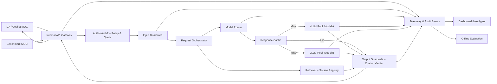

# BÁO CÁO TIẾN ĐỘ DỰ ÁN – TUẦN 1 & KẾ HOẠCH
TUẦN 2

* **Dự án:** Nền tảng Serving LLM nội bộ tích hợp Guardrail & Observability
* **Thành viên:** Nguyễn Gia Bảo, Nguyễn Lê Minh
* **Thời gian báo cáo:** Tuần 1

---

## 1. Kết quả Đạt được trong Tuần 1

Trong tuần đầu tiên, nhóm đã hoàn thành việc khảo sát, chốt yêu cầu kỹ thuật và xây dựng kiến trúc tổng thể cho hệ thống:

* **Chốt phạm vi & Tiêu chí nghiệm thu:**
  * Thống nhất 4 tiêu chí cốt lõi cần đạt được cho toàn bộ hệ sinh thái serving nội bộ.
  * Xác định rõ ràng danh mục 11 hạng mục đầu ra cần bàn giao xuyên suốt dự án.
  * Thiết lập cơ chế giám sát ngân sách hạ tầng AWS (tổng hạn mức 174,32 USD credit, kích hoạt ngưỡng cảnh báo an toàn ở mức 150 USD).

* **Thiết kế luồng xử lý hệ thống (Pipeline Architecture):**
  * Hoàn thiện luồng dữ liệu end-to-end: tiếp nhận request qua Gateway, kiểm tra phân quyền và hạn mức token, qua tầng Inbound Guardrail (quét PII, ngăn chặn Prompt Injection), điều phối qua Model Router, xử lý tầng Response Cache, kiểm định chất lượng tại Outbound Guardrail (xác thực trích dẫn và grounding) và đẩy dữ liệu về hệ thống Telemetry.

* **Thiết kế kiến trúc hạ tầng AWS:**
  * Xây dựng sơ đồ phân tầng mạng an toàn và tối ưu hiệu năng: tích hợp AWS PrivateLink, Network Load Balancer (NLB), cụm EKS (phân tách node group cho CPU và GPU), cơ sở dữ liệu Aurora, bộ nhớ đệm ElastiCache và S3 Gateway Endpoint.
  * Triển khai mô hình Stateless GPU kết hợp bộ script tự động hóa bật/tắt (lab-up / lab-down) chỉ kích hoạt GPU khi chạy kiểm thử hoặc demo nhằm tiết kiệm tối đa chi phí.

---

## 2. Danh mục Các Hạng mục Bàn giao của Dự án

1. **Hạ tầng EKS & Tự động hóa:** Bộ mã nguồn Terraform khởi tạo toàn bộ hạ tầng mạng, cụm EKS (2 node group), các addon cần thiết, kèm kịch bản lab-up/lab-down tự động và tài liệu runbook vận hành.
2. **Cụm Serving vLLM tối ưu:** Hệ thống vLLM phục vụ đồng thời nhiều mô hình trên cùng một GPU (mô hình lớn 7–8B và mô hình nhỏ 1.5–4B), kích hoạt tính năng Prefix Caching, Chunked Prefill và đồng bộ model weights trực tiếp từ Amazon S3.
3. **API Gateway tập trung (LiteLLM):** Cổng kết nối quản lý API key, giới hạn tần suất gọi (rate limit), định tuyến mô hình linh hoạt, quản lý hạn mức quota token theo từng đơn vị và tích hợp bộ đệm Redis.
4. **Báo cáo đánh giá năng lực chịu tải (Capacity Report):** Kết quả đo kiểm thực tế độ trễ p95, đánh giá so sánh hiệu năng giữa dòng GPU L4 và L40S, kiểm chứng mở rộng trên cụm 3 node và mô hình dự phóng đáp ứng mức tải 50 req/s.
5. **Pipeline Guardrail hai chiều:** Tầng bảo mật hai lớp lọc sạch dữ liệu nhạy cảm (PII), ngăn chặn tấn công injection ở đầu vào và kiểm định độ chính xác trích dẫn nguồn ở đầu ra dựa trên 7 bộ policy chuẩn hóa.
6. **Bộ dữ liệu kiểm thử an toàn tiếng Việt:** Tập kiểm thử gồm 1.500 tình huống an toàn dành riêng cho ngôn ngữ tiếng Việt, tập dữ liệu kiểm chứng độc lập (holdout set), script chấm điểm tự động và báo cáo kết quả qua 2 đợt đo.
7. **Hệ thống giám sát toàn diện (Observability):** Cụm Prometheus và dashboard Grafana trực quan hóa độ trễ, sản lượng token, chi phí phân bổ theo từng nhóm ứng dụng, đi kèm dịch vụ Lambda probe theo dõi trạng thái uptime liên tục.
8. **Khung đánh giá chất lượng mô hình (Evaluation Framework):** Bộ câu hỏi đánh giá chuẩn gồm 200 câu hỏi đa dạng và biên bản so sánh chất lượng giữa mô hình tự host với 4 mô hình API thương mại tham chiếu.
9. **Môi trường mô phỏng & Tài liệu tích hợp:** Bộ 7 ứng dụng client mẫu đại diện cho 7 đơn vị nghiệp vụ, kịch bản kiểm thử tích hợp (integration tests), công cụ sinh tải giả lập và tài liệu hướng dẫn onboarding cho đội ngũ phát triển.
10. **Báo cáo thử nghiệm thực tế (Pilot Run):** Ghi nhận quá trình vận hành thử nghiệm kéo dài 10 ngày (tương đương 85 giờ hoạt động) trên EKS, tổng hợp nhật ký sự cố và các chỉ số ổn định dịch vụ.
11. **Báo cáo tổng kết & Thiết kế kiến trúc Production:** Hồ sơ nghiệm thu toàn diện theo các tiêu chí cam kết ban đầu, kèm theo bản vẽ thiết kế hoàn chỉnh và dự toán chi phí chi tiết để đưa hệ thống lên môi trường Production.

---

## 3. Sơ đồ Pipeline Hệ thống

---

## 4. Kế hoạch Triển khai Tuần 2

Trọng tâm của tuần tiếp theo là dựng nền tảng hạ tầng, triển khai cụm serving bước đầu và thiết lập hệ thống giám sát:

### Nguyễn Gia Bảo
* **Hạ tầng & Tự động hóa:** Hoàn thiện mã nguồn Terraform thiết lập mạng và cụm EKS (2 node group); kiểm thử hoàn thiện bộ script tự động lab-up/lab-down nhằm tối ưu thời gian chạy GPU.
* **Triển khai cụm vLLM:** Viết cấu hình Helm values để triển khai mô hình A (7–8B) và mô hình B (1.5–4B) cùng chia sẻ một GPU; cấu hình kích hoạt Prefix Caching, Chunked Prefill và cơ chế nạp weights từ S3.
* **Đo kiểm hiệu năng ban đầu:** Thiết lập môi trường đo đạc và lên khung báo cáo đánh giá năng lực tính toán của cụm GPU.

### Nguyễn Lê Minh
* **Cổng Gateway LiteLLM:** Thiết lập Gateway kết nối bộ nhớ đệm Redis; cấu hình hệ thống cấp phát API key, áp dụng rate limit và phân bổ quota sử dụng token cho từng đơn vị.
* **Hệ thống giám sát (Observability):** Cấu hình exporter để đẩy metrics từ vLLM và Gateway về Prometheus; dựng các dashboard cơ bản trên Grafana để theo dõi trực quan độ trễ và tải hệ thống.
* **Bộ đánh giá chất lượng:** Hoàn thiện tập 200 câu hỏi kiểm thử chất lượng và thực hiện đợt chạy đo baseline đầu tiên trên các mô hình API thương mại làm mốc so sánh.
